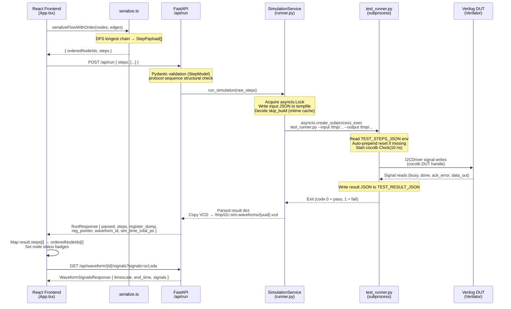

> **中文版**: [00-architecture.md](zh-TW/00-architecture.md)

# System Architecture: Full-Stack I2C Simulation Platform

## TL;DR

- Four-layer architecture: React Flow frontend → FastAPI backend → cocotb simulation subprocess → Verilog RTL (DUT)
- The critical IPC boundary is between FastAPI and the simulator: `SimulationService.run_simulation()` writes steps to a temp JSON file, spawns `test_runner.py` as a subprocess via `asyncio.create_subprocess_exec`, and reads results from a second temp JSON file (`backend/app/services/runner.py:106-173`)
- The main simulation entry point is `test_i2c_sequence()` in `backend/sim/test_runner.py:817`, which reads `TEST_STEPS_JSON` from the environment and writes results to `TEST_RESULT_JSON`
- The Verilog bus uses an output-enable (OE) + wired-AND model instead of `inout`/tri-state, required for Verilator compatibility (`backend/sim/rtl/i2c_top.v:39-41`)
- A single `asyncio.Lock` inside `SimulationService` serialises all concurrent simulation requests; callers waiting more than 120 seconds receive HTTP 503 (`backend/app/services/runner.py:71,35`)

---

## 1. Overview

This platform lets users visually compose I2C protocol sequences on a React Flow canvas and execute them against a real Verilog RTL simulation. Results — per-step pass/fail status, register dumps, and VCD waveforms — are returned to the frontend for display.

### Layer responsibilities

| Layer | Technology | Role |
|-------|-----------|------|
| Frontend | Vite + React + React Flow (`@xyflow/react`) | Visual I2C protocol builder, step serialisation, result display, waveform viewer |
| Backend API | FastAPI (Python) + uvicorn | REST endpoint, subprocess orchestration, VCD storage, concurrency gating |
| Simulation engine | cocotb 2.0 + `cocotb_tools.runner` (Verilator or Icarus) | RTL clock/reset driving, I2C signal generation, result capture |
| RTL | Verilog (SystemVerilog-compat) | I2C master FSM, slave register-file, OE bus model |

### Component topology

```
┌─────────────────────┐       HTTP/JSON         ┌──────────────────────────┐
│  Frontend           │ ──────────────────────> │  FastAPI (port 8000)     │
│  localhost:5173     │ <─────────────────────  │  backend/app/main.py     │
│  Vite + React Flow  │                         │  /api/run                │
└─────────────────────┘                         │  /api/waveform/{id}      │
                                                │  /api/templates          │
                                                └────────────┬─────────────┘
                                                             │ asyncio.create_subprocess_exec
                                                             │ (temp JSON files)
                                                             ▼
                                                ┌──────────────────────────┐
                                                │  test_runner.py          │
                                                │  backend/sim/            │
                                                │  cocotb 2.0 + Verilator  │
                                                └────────────┬─────────────┘
                                                             │ cocotb DUT handle
                                                             ▼
                                                ┌──────────────────────────┐
                                                │  i2c_system_wrapper.v    │
                                                │  └── i2c_top.v           │
                                                │      ├── i2c_master.v    │
                                                │      └── i2c_slave.v     │
                                                └──────────────────────────┘
```

### Module boundaries

- `backend/app/` imports from `sim.` prefix (e.g., `from sim.protocol_interpreter import validate_protocol_sequence` at `backend/app/routes/simulation.py:14`)
- `backend/sim/` uses bare imports (e.g., `from i2c_driver import I2CDriver` at `backend/sim/test_runner.py:102`) because the subprocess runs with `cwd=sim/`
- Frontend communicates only through `frontend/src/lib/api.ts`; all API base URL resolution happens at `frontend/src/lib/api.ts:3` (`VITE_API_URL || '/api'`)

---

## 2. Data Flow

### Request lifecycle: UI to simulation to results



### Protocol and format details

| Boundary | Protocol / Format | Key Location |
|----------|------------------|--------------|
| Browser → FastAPI | HTTP POST JSON `{ "steps": [...] }` | `frontend/src/lib/api.ts:81-85` |
| FastAPI → subprocess | `asyncio.create_subprocess_exec` + two temp `.json` files | `backend/app/services/runner.py:215-229` |
| Input temp file schema | `{ "steps": [ {"op": "...", ...} ] }` | `backend/app/services/runner.py:161` |
| Output temp file schema | `{ "passed": bool, "steps": [...], "register_dump": {...}, "reg_pointer": int, "vcd_path": str, "sim_time_total_ps": int }` | `backend/sim/test_runner.py:761-768` |
| Steps env var | `TEST_STEPS_JSON` (JSON-encoded list) | `backend/sim/test_runner.py:835` |
| Result env var | `TEST_RESULT_JSON` (file path) | `backend/sim/test_runner.py:871` |
| VCD storage | `tmpdir/i2c-sim-waveforms/{uuid}.vcd` (30 min TTL) | `backend/app/services/waveform.py:21-23` |
| VCD signals API | `GET /api/waveform/{id}/signals?signals=scl,sda` | `backend/app/routes/simulation.py:209` |

### IPC JSON schemas

**Input file** (`/tmp/i2c_sim_input_*.json`):

```json
{
  "steps": [
    { "op": "reset" },
    { "op": "start" },
    { "op": "send_byte", "data": "0xA0" },
    { "op": "send_byte", "data": "0x00" },
    { "op": "recv_byte", "ack": false },
    { "op": "stop" }
  ]
}
```

**Output file** (`/tmp/i2c_sim_output_*.json`):

```json
{
  "passed": true,
  "steps": [
    { "op": "start", "status": "ok", "time_range_ps": [1000, 2500] },
    { "op": "send_byte", "data": "0xa0", "addr": "0x50", "rw": "write", "status": "ok", "time_range_ps": [2500, 12000] },
    { "op": "send_byte", "data": "0x0", "status": "ok", "time_range_ps": [12000, 21500] },
    { "op": "recv_byte", "ack": false, "data": "0xff", "status": "ok", "time_range_ps": [21500, 31000] },
    { "op": "stop", "status": "ok", "time_range_ps": [31000, 32000] }
  ],
  "register_dump": { "0": 255 },
  "reg_pointer": 0,
  "vcd_path": "i2c_system_cocotb.vcd",
  "sim_time_total_ps": 32000
}
```

---

## 3. Code Map

| Component | File Path | Key Function / Class | Evidence Location | Description |
|-----------|-----------|---------------------|-------------------|-------------|
| App root & run handler | `frontend/src/App.tsx` | `App`, `handleRun` | `App.tsx:285,544` | Owns all canvas state; calls `serializeFlowWithOrder` then `runSimulation`; maps result steps back to node IDs |
| Flow serialiser | `frontend/src/lib/serialize.ts` | `serializeFlowWithOrder` | `serialize.ts:214` | DFS longest-chain traversal of React Flow graph → ordered `StepPayload[]` for the API |
| Frontend API client | `frontend/src/lib/api.ts` | `runSimulation`, `getWaveformSignals` | `api.ts:80,163` | Typed fetch wrappers; normalises `status` → `passed` on response |
| FastAPI entry point | `backend/app/main.py` | `app`, `lifespan` | `main.py:27,14` | Mounts routers, starts VCD TTL cleanup task on lifespan startup |
| Simulation route | `backend/app/routes/simulation.py` | `run_simulation` (route) | `simulation.py:100` | Validates request, allocates waveform UUID, calls `SimulationService`, copies VCD |
| Simulation service | `backend/app/services/runner.py` | `SimulationService.run_simulation` | `runner.py:106` | Acquires `asyncio.Lock`, writes/reads temp JSON files, manages build-cache mtime |
| Subprocess launcher | `backend/app/services/runner.py` | `SimulationService._invoke_runner` | `runner.py:179` | Assembles CLI command with `sys.executable`, calls `asyncio.create_subprocess_exec`, enforces 60 s timeout |
| cocotb test entry | `backend/sim/test_runner.py` | `test_i2c_sequence` | `test_runner.py:817` | cocotb coroutine: reads env vars, auto-prepends reset, starts `Clock(10 ns)`, calls `run_sequence` |
| Simulation runner API | `backend/sim/test_runner.py` | `run_simulation` | `test_runner.py:888` | Calls `cocotb_tools.runner` build + test; sets Verilator flags `--trace --public-flat-rw --timing` |
| Step parser | `backend/sim/test_runner.py` | `parse_sequence`, `parse_step` | `test_runner.py:333,242` | Validates op names against `VALID_OPS`; converts hex strings to ints |
| Step executor | `backend/sim/test_runner.py` | `execute_sequence` | `test_runner.py:619` | Dispatches legacy ops immediately; buffers protocol ops between `start`/`stop` for `ProtocolInterpreter` |
| VCD waveform store | `backend/app/services/waveform.py` | `allocate_vcd_path`, `start_cleanup_task` | `waveform.py:32,82` | UUID-named files in `tmpdir/i2c-sim-waveforms/`; background 30 min TTL cleanup |
| Wired-AND bus | `backend/sim/rtl/i2c_top.v` | `sda`, `scl` wires | `i2c_top.v:39-41` | OE + wired-AND model: `sda = ~(master_sda_oe \| slave_sda_oe)`; avoids tri-state for Verilator |
| Testbench wrapper | `backend/sim/tb/i2c_system_wrapper.v` | `i2c_system_wrapper` | `i2c_system_wrapper.v:3` | Top-level cocotb DUT; wraps `i2c_top`; conditional `$dumpfile` only for Icarus |

---

## 4. Troubleshooting

### Problem: Simulation hangs and is killed after timeout

**Symptoms**
- `POST /api/run` returns HTTP 500 with "Simulation timed out after 60 seconds"
- Subprocess is killed with `process.kill()` before producing any output JSON

**Possible Causes**
1. Missing reset step — DUT signals are in undefined state on first use; cocotb waits on `done`/`busy` indefinitely
2. RTL FSM stuck in a state it cannot exit (e.g., waiting for an ACK that never arrives because of mismatched address)
3. Verilator binary was built without `--timing`, causing all `await` triggers to never fire

**Check Locations**
- Auto-prepend logic: `backend/sim/test_runner.py:844-849` (verifies a reset is injected if missing)
- Timeout kill code: `backend/app/services/runner.py:235-244`
- Verilator build flags: `backend/sim/test_runner.py:948-956`

**Fix Direction**
- Ensure the first step is `reset` or rely on the auto-prepend at `test_runner.py:847`
- Add `--timing` to Verilator build flags if missing
- Check slave address configuration: `i2c_system_wrapper.v:6` sets `SLAVE_ADDR = 7'h50`

---

### Problem: `POST /api/run` returns HTTP 503

**Symptoms**
- Browser receives `503 Service Unavailable` with "Server is busy"
- Multiple simultaneous requests from the same or different clients

**Possible Causes**
1. A previous simulation is still running (Verilator compile + simulation can take several seconds)
2. A stuck simulation is holding the lock until the 60 s subprocess timeout fires, blocking subsequent requests for up to `QUEUE_TIMEOUT = 120` s

**Check Locations**
- Lock and queue timeout: `backend/app/services/runner.py:71,35,143-151`
- Route error handling: `backend/app/routes/simulation.py:135-136`

**Fix Direction**
- Reduce `DEFAULT_TIMEOUT` or `QUEUE_TIMEOUT` constants in `runner.py:31,35` for faster failover
- Enable build caching (automatic via RTL mtime check at `runner.py:93-104`) to reduce per-request cost

---

### Problem: Waveform download returns 404

**Symptoms**
- `GET /api/waveform/{id}` returns 404 after a successful simulation
- Waveform panel in the frontend shows no signals

**Possible Causes**
1. VCD file expired and was deleted by the background cleanup task (30 min TTL by default)
2. The simulator produced no VCD — e.g., Verilator build was invoked without `--trace`
3. VCD copy from `sim_build/` to managed storage failed silently due to an `OSError` (caught at `simulation.py:158-159`)

**Check Locations**
- VCD TTL and cleanup: `backend/app/services/waveform.py:14,42-62`
- VCD copy step: `backend/app/routes/simulation.py:151-159`
- Icarus-only `$dumpfile`: `backend/sim/tb/i2c_system_wrapper.v:52-56`

**Fix Direction**
- Increase TTL via `VCD_TTL_MINUTES` environment variable (default 30)
- Verify `--trace` is present in the Verilator build args at `test_runner.py:948-956`
- Check stderr from the subprocess for copy failures; the `RuntimeError` at `runner.py:262-266` surfaces it

---

### Problem: Subprocess exits with non-zero code but no result JSON

**Symptoms**
- `POST /api/run` returns HTTP 500 with "produced no result JSON"
- stderr from `test_runner.py` is included in the error message

**Possible Causes**
1. RTL compilation failed (missing Verilog source, syntax error in `.v` files)
2. Python import error in `test_runner.py` or its dependencies (`i2c_driver.py`, `protocol_interpreter.py`)
3. Subprocess was invoked with the wrong Python interpreter (not the `.venv` one), so cocotb is not installed

**Check Locations**
- Subprocess command construction: `backend/app/services/runner.py:215-220` (uses `sys.executable`)
- Stderr surface: `backend/app/services/runner.py:261-266`
- RTL source list: `backend/sim/test_runner.py:155-160`

**Fix Direction**
- Always start the backend with `.venv` Python: `source .venv/bin/activate && cd backend && python3 -m uvicorn app.main:app ...`
- This ensures `sys.executable` at `runner.py:216` points to the venv Python that has cocotb installed

---

## 5. Extension Guide

### Adding a new I2C operation type

The `op` field travels through five layers. Changes are needed in each:

1. **Add the op name to `VALID_OPS`** in `backend/sim/test_runner.py:217-231` and `_VALID_OPS` in `backend/app/routes/simulation.py:23-28`
2. **Implement `parse_step` handling** in `backend/sim/test_runner.py:242-330` — add an `elif op == "new_op":` branch normalising parameters
3. **Implement execution handling** — legacy ops (e.g. `write_bytes`) are dispatched directly by `execute_step` in `backend/sim/test_runner.py:360-457`; protocol ops (e.g. `send_byte`) are buffered between `start`..`stop` and processed by `execute_sequence` via `ProtocolInterpreter`, with result building at `test_runner.py:580-596`
4. **Create the corresponding React Flow node type** under `frontend/src/components/nodes/` following the pattern of `SendByteNode`
5. **Register the node type** in `frontend/src/App.tsx:91-97` (`nodeTypes` map) and add a case in `mapNodeToStep` in `frontend/src/lib/serialize.ts:118-144`
6. **Add the Pydantic model field** in `backend/app/routes/simulation.py:39-44` if the op has a payload field that needs validation (currently uses `extra = "allow"`)

Reference implementation: `send_byte` is the simplest parameterised protocol op — parse at `test_runner.py:292-300`, execute at `test_runner.py:580-596` (inside `execute_sequence`), frontend at `serialize.ts:131-134`. Note: protocol ops raise `ValueError` if they reach `execute_step` directly (lines ~396-404); they follow a different path from legacy ops like `write_bytes`.

---

### Adding a new API endpoint

1. Add a new route function to an existing router or create a new file in `backend/app/routes/`
2. Include the new router in `backend/app/main.py:42-43` with `app.include_router(router, prefix="/api")`
3. Add a corresponding typed fetch function to `frontend/src/lib/api.ts` following the pattern of `runSimulation` at `api.ts:80-103`

---

### Switching the default simulator

The default is Verilator. To switch to Icarus:

- Pass `simulator="icarus"` to `run_simulation()` in `backend/sim/test_runner.py:888-977`
- Or via CLI: `python test_runner.py --simulator icarus --input ... --output ...`
- Icarus uses `_VcdIcarus` (a subclass at `test_runner.py:106`) which omits `-fst`/`-none` flags so that `$dumpfile`/`$dumpvars` in the wrapper produce plain-text VCD
- Verilator requires a minimum version of 5.024 (cocotb 2.0 compatibility); 5.046+ is recommended

---

### Adding a new RTL source file

1. Add the `.v` file to `backend/sim/rtl/`
2. Append the path to `_VERILOG_SOURCES` in `backend/sim/test_runner.py:155-160`
3. Append the path to `_RTL_SOURCES` in `backend/app/services/runner.py:24-28` so the mtime build-cache tracks the new file
4. Wire the module into `i2c_top.v` or `i2c_system_wrapper.v` as appropriate

---

## Assumptions / To Be Confirmed

- `ASSUMPTION:` The VCD file produced by Verilator is located inside the `sim_build/` directory and referenced relative to `_SIM_DIR` in `simulation.py:154`. The exact sub-path within `sim_build/` was not traced to a concrete filesystem path in the source — the route handler copies the file using `_sim_dir / sim_vcd_path` where `sim_vcd_path` is the value of `vcd_path` returned in the result JSON (just the filename `"i2c_system_cocotb.vcd"`).
- `ASSUMPTION:` The frontend runs on `localhost:5173` by default (Vite default); this was not verified against a `vite.config.ts` but is stated in `CLAUDE.md`.

---

## Related Files Index

- `/home/linrswa/dev/verilog/i2c_lab/frontend/src/App.tsx`
- `/home/linrswa/dev/verilog/i2c_lab/frontend/src/lib/api.ts`
- `/home/linrswa/dev/verilog/i2c_lab/frontend/src/lib/serialize.ts`
- `/home/linrswa/dev/verilog/i2c_lab/backend/app/main.py`
- `/home/linrswa/dev/verilog/i2c_lab/backend/app/routes/simulation.py`
- `/home/linrswa/dev/verilog/i2c_lab/backend/app/services/runner.py`
- `/home/linrswa/dev/verilog/i2c_lab/backend/app/services/waveform.py`
- `/home/linrswa/dev/verilog/i2c_lab/backend/sim/test_runner.py`
- `/home/linrswa/dev/verilog/i2c_lab/backend/sim/i2c_driver.py`
- `/home/linrswa/dev/verilog/i2c_lab/backend/sim/protocol_interpreter.py`
- `/home/linrswa/dev/verilog/i2c_lab/backend/sim/rtl/i2c_top.v`
- `/home/linrswa/dev/verilog/i2c_lab/backend/sim/rtl/i2c_master.v`
- `/home/linrswa/dev/verilog/i2c_lab/backend/sim/rtl/i2c_slave.v`
- `/home/linrswa/dev/verilog/i2c_lab/backend/sim/tb/i2c_system_wrapper.v`
- `/home/linrswa/dev/verilog/i2c_lab/pyproject.toml`
