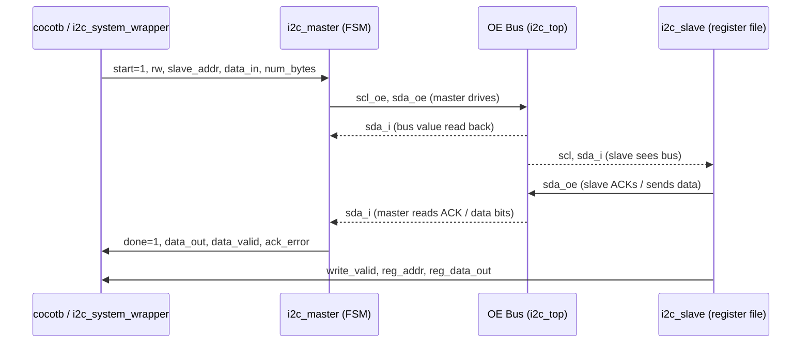

# RTL: I2C Master/Slave System — Verilog Design Reference

## TL;DR

- Four Verilog files implement a complete I2C master + slave system: `i2c_master.v`, `i2c_slave.v`, `i2c_top.v`, and `i2c_system_wrapper.v` (cocotb entry point).
- The master is an 8-state FSM clocked at `CLK_DIV` system ticks per I2C bit period (`i2c_master.v:38-45`).
- The slave contains a 256-byte EEPROM register file with auto-incrementing address (`i2c_slave.v:23`).
- Bus contention is resolved via a wired-AND OE model — no Verilog `inout`/`pullup`/`1'bz` — making the design Verilator-compatible: `sda = ~(master_sda_oe | slave_sda_oe)` (`i2c_top.v:40`).
- The cocotb wrapper `i2c_system_wrapper.v` has no Verilog `#delay` clock; the clock is injected by cocotb's `Clock` generator to work with both Icarus Verilog and Verilator (`i2c_system_wrapper.v:47-49`).

---

## 1. Overview

### What this module does

The RTL layer implements a synthesisable I2C subsystem consisting of:

| File | Role |
|------|------|
| `backend/sim/rtl/i2c_master.v` | I2C master controller — generates SCL, drives SDA, executes the 8-state transaction FSM |
| `backend/sim/rtl/i2c_slave.v` | I2C slave — responds to address match, owns a 256-byte EEPROM register file |
| `backend/sim/rtl/i2c_top.v` | System integrator — wires master and slave together via the OE bus model |
| `backend/sim/tb/i2c_system_wrapper.v` | Cocotb DUT wrapper — thin shell for simulator integration, no test logic |
| `backend/sim/tb/i2c_system_tb.v` | Pure-Verilog self-checking testbench (standalone, not used by cocotb) |

### Role in the system

The RTL module is the simulation target. The cocotb Python test framework drives the DUT through the ports exposed by `i2c_system_wrapper`, produces waveform traces (VCD or FST), and the backend API interprets results. The RTL is not intended for FPGA synthesis in this project, but the design is synthesisable modulo the `initial` block in `i2c_slave.v` used for register-file initialisation.

### Boundaries and dependencies

- **Upstream (inputs)**: cocotb Python driver via `i2c_system_wrapper` ports — `clk`, `rst_n`, `start`, `rw`, `slave_addr`, `data_in`, `num_bytes`, `repeated_start`, `slave_addr_cfg`.
- **Downstream (outputs)**: `busy`, `done`, `ack_error`, `data_out`, `data_valid`, `byte_count` (master); `slave_busy`, `reg_addr`, `reg_data_out`, `write_valid` (slave).
- **Internal bus**: The `sda` and `scl` wires in `i2c_top.v` are computed by combinational logic — they are not exported to the wrapper.

---

## 2. Data Flow



### Signal and protocol details

| Signal path | Direction | Width | Protocol / notes |
|-------------|-----------|-------|-----------------|
| `sda = ~(master_sda_oe \| slave_sda_oe)` | combinational wire | 1 | Wired-AND open-drain; `i2c_top.v:40` |
| `scl = ~master_scl_oe` | combinational wire | 1 | Only master drives SCL; `i2c_top.v:41` |
| `clk` | input | 1 | System clock; 10 ns period in wrapper default config |
| `data_out` | master → TB | 8 | Updated on `data_valid` pulse (each byte read); `i2c_master.v:160` |
| `write_valid` | slave → TB | 1 | One-cycle pulse after each byte written to register file; `i2c_slave.v:193` |

### Clock divider timing

The master uses a free-running divider counter (`clk_div_cnt`, `i2c_master.v:47`) that wraps at `CLK_DIV`. Four timing landmarks are derived:

| Localparam | Value (CLK_DIV=100) | Meaning |
|------------|---------------------|---------|
| `N_EDGE`   | 0                   | Negative SCL edge instant |
| `LOW_MID`  | 25                  | Mid-point of SCL low half — change SDA |
| `P_EDGE`   | 50                  | Positive SCL edge instant |
| `HIGH_MID` | 75                  | Mid-point of SCL high half — sample SDA |

Source: `i2c_master.v:33-36`.

---

## 3. Code Map

| Component | File | Evidence Location | Description |
|-----------|------|-------------------|-------------|
| Master module port list | `backend/sim/rtl/i2c_master.v` | `:2-28` | All master I/O ports: control inputs, status outputs, OE bus interface |
| `CLK_DIV` parameter | `backend/sim/rtl/i2c_master.v` | `:31` | Ticks per I2C bit period; default 100 |
| Timing localparams `N_EDGE / LOW_MID / P_EDGE / HIGH_MID` | `backend/sim/rtl/i2c_master.v` | `:33-36` | Phase-critical SDA change / sample points within each SCL period |
| FSM state encoding (8 states) | `backend/sim/rtl/i2c_master.v` | `:38-45` | `IDLE`, `START`, `ADDR`, `WRITE`, `READ`, `ACK`, `REPEATED_START`, `STOP` |
| Clock divider counter | `backend/sim/rtl/i2c_master.v` | `:56-64` | Async-reset counter; drives all FSM timing decisions |
| SCL generation always block | `backend/sim/rtl/i2c_master.v` | `:67-83` | `scl_oe=0` (high) in IDLE/START; toggles low/high at P_EDGE otherwise |
| Master FSM always block | `backend/sim/rtl/i2c_master.v` | `:87-273` | Main state machine: all 8 state handlers |
| START state — SDA pull-down | `backend/sim/rtl/i2c_master.v` | `:117-121` | SDA driven low at `HIGH_MID` while SCL high; forms I2C START condition |
| ADDR state — MSB-first shift | `backend/sim/rtl/i2c_master.v` | `:124-126` | `sda_oe <= ~addr_buf[7-bit_cnt]` at `LOW_MID` |
| ACK state — NACK detection | `backend/sim/rtl/i2c_master.v` | `:188-201` | Samples `sda_i` at `HIGH_MID`; sets `ack_error` if high |
| ACK state — master NACK (last read byte) | `backend/sim/rtl/i2c_master.v` | `:177-181` | Master holds SDA high (releases `sda_oe`) on final byte to signal NACK |
| REPEATED_START state | `backend/sim/rtl/i2c_master.v` | `:255-269` | Re-asserts SDA low while SCL high; re-enters ADDR with refreshed `addr_buf` |
| STOP state | `backend/sim/rtl/i2c_master.v` | `:242-254` | Pulls SDA low at `LOW_MID`, releases at `HIGH_MID`; pulses `done` |
| Slave module port list | `backend/sim/rtl/i2c_slave.v` | `:3-22` | Slave I/O: `slave_addr` config, status outputs, OE bus interface (receives `scl` directly) |
| Slave register file | `backend/sim/rtl/i2c_slave.v` | `:23-29` | `register_file[0:255]` — 256 × 8-bit, zero-initialised in `initial` block |
| START / STOP condition detection | `backend/sim/rtl/i2c_slave.v` | `:37-41` | Combinational wires watching `scl` and `sda_prev`/`sda_i` edges |
| `in_read_ack_window` guard | `backend/sim/rtl/i2c_slave.v` | `:56-91` | Suppresses false STOP detection when master releases SDA during read-ACK phase |
| Slave FSM state encoding | `backend/sim/rtl/i2c_slave.v` | `:50` | `IDLE`, `ADDR`, `ACK`, `READ`, `WRITE` (5 states) |
| Slave ADDR state — address match | `backend/sim/rtl/i2c_slave.v` | `:107-125` | Shifts 8 bits on `scl_rising`; compares `slave_addr_recive[7:1]` to `slave_addr` on `scl_falling` after bit 8 |
| Slave WRITE state — register write and auto-increment | `backend/sim/rtl/i2c_slave.v` | `:181-199` | First received byte sets `reg_addr`; subsequent bytes write `register_file[reg_addr]` and increment `reg_addr` |
| Slave READ state — register read and auto-increment | `backend/sim/rtl/i2c_slave.v` | `:168-180` | Outputs `register_file[reg_addr][7-bit_cnt]` inverted to `sda_oe`; auto-increments on ACK |
| OE bus wired-AND equation | `backend/sim/rtl/i2c_top.v` | `:40-41` | `sda = ~(master_sda_oe \| slave_sda_oe)` and `scl = ~master_scl_oe` |
| `i2c_top` parameter and port list | `backend/sim/rtl/i2c_top.v` | `:4-35` | `CLK_DIV` parameter; all master + slave ports forwarded |
| Master instance in top | `backend/sim/rtl/i2c_top.v` | `:44-64` | `i2c_master #(.CLK_DIV(CLK_DIV)) master_inst` |
| Slave instance in top | `backend/sim/rtl/i2c_top.v` | `:67-78` | `i2c_slave slave_inst` — receives computed `scl` and `sda` wires |
| Wrapper default parameters | `backend/sim/tb/i2c_system_wrapper.v` | `:5-6` | `CLK_DIV=50`, `SLAVE_ADDR=7'h50` |
| Wrapper VCD guard | `backend/sim/tb/i2c_system_wrapper.v` | `:52-57` | VCD dump only under Icarus; Verilator uses `--trace` build flag |
| Standalone TB protocol checker | `backend/sim/tb/i2c_system_tb.v` | `:74-87` | Monitors `sda_bus` and `scl_bus` for START/STOP edges; prints timestamp |
| Standalone TB `master_write` task | `backend/sim/tb/i2c_system_tb.v` | `:134-170` | Drives 1-3-byte write transactions with fork/disable for early-NACK handling |
| Standalone TB `write_then_read` task | `backend/sim/tb/i2c_system_tb.v` | `:198-211` | Pointer-write followed by sequential read; demonstrates typical EEPROM access pattern |

---

## 4. Troubleshooting

### Problem: Simulation hangs and never asserts `done`

**Symptoms**
- Cocotb test times out (>15 seconds wall time) or the standalone TB hits the 5 ms `$finish` watchdog (`i2c_system_tb.v:61-65`).
- `busy` remains high; `done` never pulses.

**Possible Causes**
1. `rst_n` was never deasserted — the FSM stays in reset; `start` is ignored.
2. The cocotb driver issued `start=1` before the DUT's `rst_n` was released.
3. The slave address sent by the master (`slave_addr`) does not match `slave_addr_cfg`, causing the slave to return NACK on address, and the master FSM transitions to STOP — but if `done` still never fires the clock may not be running.

**Check Locations**
- `i2c_master.v:87-100` — reset initialisation of FSM; confirm `state` reaches `IDLE` after `rst_n` goes high.
- `i2c_system_wrapper.v:47-49` — clock comment; confirm cocotb `Clock` generator is started before the first `await RisingEdge`.
- `i2c_master.v:104-113` — IDLE state; `start` must arrive at least one cycle after `rst_n=1`.

**Fix Direction**
- Ensure the cocotb test calls `await RisingEdge(dut.clk)` several times after deasserting `rst_n` before asserting `start`.
- Verify `slave_addr_cfg` is driven to the same value as `slave_addr` in the transaction.

---

### Problem: `ack_error` asserted unexpectedly

**Symptoms**
- `ack_error` goes high after the address phase or a write byte.
- Transaction terminates early (master moves to STOP).

**Possible Causes**
1. Address mismatch — `slave_addr` in the transaction differs from `slave_addr_cfg` wired into the slave.
2. Timing issue — `sda_i` sampled by master at `HIGH_MID` (`i2c_master.v:187`) before the slave has released its `sda_oe`, causing the bus to read HIGH (NACK).
3. `CLK_DIV` too small — the slave's edge-detection logic (`scl_rising`, `scl_falling` at `i2c_slave.v:44-45`) may miss transitions if `CLK_DIV < 4`.

**Check Locations**
- `i2c_top.v:40` — confirm wired-AND is correct; if `slave_sda_oe` is stuck high the bus stays low (ACK phantom) or if both are 0 the bus is always high (NACK).
- `i2c_master.v:188-201` — ACK sampling at `HIGH_MID`; cross-reference with slave `ACK` state at `i2c_slave.v:127-167`.
- `i2c_slave.v:113-124` — address bit count must reach 8 before the compare; confirm `bit_cnt` increments on every `scl_rising`.

**Fix Direction**
- Increase `CLK_DIV` (minimum practical value is ~8 for the slave's edge-detection latency).
- Add waveform inspection: dump `master_sda_oe`, `slave_sda_oe`, `sda` together to verify bus state at `HIGH_MID`.

---

### Problem: Slave reads back wrong data (stale or shifted values)

**Symptoms**
- A read transaction returns bytes that are offset by one from the expected register address.
- After a multi-byte write, the data appears in registers `[N+1]` instead of `[N]`.

**Possible Causes**
1. Register pointer not set before read — the slave's `reg_addr` is initialised to 0 at reset but retains its last value across transactions. A read without a preceding pointer-write reads from wherever `reg_addr` left off.
2. Auto-increment double-step — in WRITE state the slave increments `reg_addr` in the ACK handler (`i2c_slave.v:158`); the first received byte after address phase is treated as the pointer byte, not data (`i2c_slave.v:191-192`).

**Check Locations**
- `i2c_slave.v:130-139` — `ACK` + `ack_state==ADDR` handler; `first_byte_received` initialised to 0 here, so the next byte in WRITE sets `reg_addr`.
- `i2c_slave.v:181-199` — WRITE state; `first_byte_received == 0` causes `reg_addr <= shift_reg` (pointer), `first_byte_received == 1` causes `register_file[reg_addr] <= shift_reg` (data).
- `i2c_slave.v:142-151` — `ACK` + `ack_state==READ` handler; `reg_addr` increments here on each ACK from the master.

**Fix Direction**
- Always issue a write transaction (1 byte = register pointer) before a read transaction. The `write_then_read` task in `i2c_system_tb.v:198-211` demonstrates the correct pattern.
- For sequential multi-byte reads the auto-increment is intentional; ensure the pointer write targets the first address in the desired range.

---

### Problem: False STOP detected by slave during multi-byte read

**Symptoms**
- The slave drops to IDLE prematurely mid-read, returning garbage or fewer bytes than requested.

**Possible Causes**
1. The `in_read_ack_window` guard is not suppressing the false STOP. This can occur if `in_read_ack_window` is cleared one cycle too early.
2. The guard register state is reset unexpectedly (e.g., external `rst_n` glitch).

**Check Locations**
- `i2c_slave.v:56-91` — `in_read_ack_window` assignment and `stop_condition` guard; the window covers `state==READ` and `state==ACK && ack_state==READ`.
- `i2c_slave.v:37-41` — `start_condition` and `stop_condition` combinational wires; inspect in waveform while the master transitions from READ to ACK.

**Fix Direction**
- Widen the guard window if needed by adding one pipeline cycle to `in_read_ack_window`.
- Verify the waveform shows `stop_condition` remaining 0 throughout the inter-byte ACK period.

---

## 5. Extension Guide

### Adding a second I2C slave (multi-slave bus)

**What to add**
- A second `i2c_slave` instance with a different `slave_addr_cfg`.
- Additional `sda_oe` wire from the new slave.

**Files to modify**
- `backend/sim/rtl/i2c_top.v` — extend the wired-AND equation:

  Current at `i2c_top.v:39-41`:
  ```verilog
  wire master_sda_oe, slave_sda_oe, master_scl_oe;
  wire sda = ~(master_sda_oe | slave_sda_oe);
  wire scl = ~master_scl_oe;
  ```

  Extended pattern:
  ```verilog
  wire master_sda_oe, slave0_sda_oe, slave1_sda_oe, master_scl_oe;
  wire sda = ~(master_sda_oe | slave0_sda_oe | slave1_sda_oe);
  wire scl = ~master_scl_oe;
  ```

- Add a second `i2c_slave` instance block following the pattern at `i2c_top.v:67-78`, with `.slave_addr(slave_addr_cfg_1)` and `.sda_oe(slave1_sda_oe)`.

**Files to create**
- No new files needed; the slave RTL is already parameterised.

**Patterns to follow**
- Reference the existing slave instance at `i2c_top.v:67-78`.
- Export the new slave's `reg_addr`, `reg_data_out`, `write_valid` through `i2c_top` ports if cocotb needs to observe them.

---

### Adding a new master FSM state (e.g., 10-bit addressing)

**What to add**
- New localparam state constant(s) in `i2c_master.v`.
- New `case` branches in the SCL always block (`i2c_master.v:67-83`) if the state needs custom SCL behaviour.
- New `case` branch in the FSM always block (`i2c_master.v:87-273`).

**Files to modify**
- `backend/sim/rtl/i2c_master.v` — extend the state encoding at `:38-45` (3-bit state register can hold 8 states; widen `state` to 4 bits if more than 8 states are needed).

**Patterns to follow**
- SDA changes must occur at `LOW_MID`; SDA sampling at `HIGH_MID`. See ADDR state (`i2c_master.v:123-137`) as the reference implementation.
- `bit_cnt` is reset to 0 in the ACK state (`i2c_master.v:240`); maintain this convention in new states.

---

### Extending the slave EEPROM register file size

**What to add**
- Wider `reg_addr` register and `register_file` array.

**Files to modify**
- `backend/sim/rtl/i2c_slave.v` — change the array declaration at `:23`:

  Current:
  ```verilog
  reg [7:0] register_file[0:255];
  ```

  For 512 bytes:
  ```verilog
  reg [7:0] register_file[0:511];
  reg [8:0] reg_addr;
  ```

- Update the `initial` loop at `:26-28` to cover the new range.
- The slave module's `reg_addr` output port is declared `[7:0]` (`i2c_slave.v:12`); widen to `[8:0]` and update `i2c_top.v:33` and `i2c_system_wrapper.v` accordingly.

**Patterns to follow**
- The auto-increment logic is in `i2c_slave.v:147-149` (READ ACK) and `:158` (WRITE ACK) — no change needed beyond widening the register.

---

## Assumptions / To Be Confirmed

- `ASSUMPTION:` The `i2c_system_tb.v` standalone testbench is not invoked by the cocotb test runner. It appears to be a development aid only; no `Makefile` or runner entry point referencing it was found in scope.
- `ASSUMPTION:` The `CLK_DIV=50` default in `i2c_system_wrapper.v` (not 100 as in `i2c_master.v`) is intentional — the wrapper targets a faster simulation. Both values are valid; the cocotb runner overrides this via the `i2c_top` parameter.

---

## Related Files Index

- `/home/linrswa/dev/verilog/i2c_lab/backend/sim/rtl/i2c_master.v`
- `/home/linrswa/dev/verilog/i2c_lab/backend/sim/rtl/i2c_slave.v`
- `/home/linrswa/dev/verilog/i2c_lab/backend/sim/rtl/i2c_top.v`
- `/home/linrswa/dev/verilog/i2c_lab/backend/sim/tb/i2c_system_wrapper.v`
- `/home/linrswa/dev/verilog/i2c_lab/backend/sim/tb/i2c_system_tb.v`
