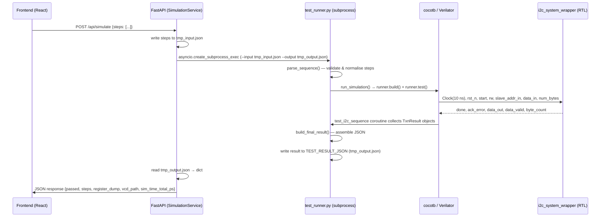

# Simulation Layer: cocotb I2C Test Runner and Driver Reference

## TL;DR

- `test_runner.py` is the single entry point for JSON-driven simulation: it parses an input step list, runs a cocotb coroutine against the DUT, and writes a structured JSON result (`backend/sim/test_runner.py:888-978`).
- `I2CDriver` wraps every DUT signal interaction so higher-level code never touches wires directly; its primary methods are `reset`, `write_bytes`, `read_bytes`, `scan`, `execute_transactions`, and `get_register_dump` (`backend/sim/i2c_driver.py:42-895`).
- `ProtocolInterpreter.interpret()` converts fine-grained protocol steps (`start`, `send_byte`, `recv_byte`, `repeated_start`, `stop`) into `Transaction` dataclass objects that the driver executes atomically (`backend/sim/protocol_interpreter.py:113-301`).
- The FastAPI backend spawns `test_runner.py` as a subprocess, communicating input and output exclusively through temporary JSON files and an `asyncio.Lock` for single-concurrency serialisation (`backend/app/services/runner.py:106-173`).
- Verilator is the default simulator; Icarus is the fallback. Three Verilator-required build flags are `--trace`, `--public-flat-rw`, and `--timing` (`backend/sim/test_runner.py:948-956`).

---

## 1. Overview

The simulation layer sits between the FastAPI backend and the Verilog DUT. Its responsibilities are:

1. **Accepting test sequences** as JSON (either from the HTTP API or the CLI) and validating them before any simulation cost is incurred.
2. **Driving the DUT** through the cocotb Python interface, managing clock startup, reset sequencing, and signal timing for every I2C transaction type.
3. **Interpreting results** — mapping per-byte timing, ACK/NACK status, and register file snapshots back into a structured JSON document consumed by the frontend.

### Boundaries

| Boundary | Direction | Notes |
|----------|-----------|-------|
| FastAPI (`SimulationService.run_simulation`) | Caller → simulation | Writes `{"steps": [...]}` to a temp file; reads result JSON back (`backend/app/services/runner.py:156-161`) |
| `test_runner.py` CLI / cocotb entry point | Boundary | Receives steps via `TEST_STEPS_JSON` env var; writes result to `TEST_RESULT_JSON` (`backend/sim/test_runner.py:835-874`) |
| `I2CDriver` | Simulation → DUT signals | Wraps `i2c_system_wrapper` ports; never exposes raw cocotb handles to callers (`backend/sim/i2c_driver.py:26-41`) |
| RTL (`i2c_system_wrapper`) | DUT | Signals documented in `docs/01-rtl.md`; DUT uses `CLK_DIV=50`, `SLAVE_ADDR=0x50` by default |

### Import conventions

Files under `backend/sim/` use bare module imports because the subprocess always runs with `cwd=backend/sim/`:

```python
# backend/sim/test_runner.py:102-103
from i2c_driver import I2CDriver
from protocol_interpreter import ProtocolInterpreter
```

Files under `backend/app/` use package-qualified imports (`from sim.protocol_interpreter import ...`) because they run in the FastAPI process where `backend/` is the root.

---

## 2. Data Flow



### Protocol and format details

| Component | Format | Evidence |
|-----------|--------|----------|
| Input to subprocess | JSON file `{"steps": [...]}` | `backend/app/services/runner.py:161` |
| Steps to cocotb | `TEST_STEPS_JSON` env var (JSON string) | `backend/sim/test_runner.py:835-836` |
| Output from cocotb | `TEST_RESULT_JSON` env var → file path | `backend/sim/test_runner.py:871-874` |
| VCD waveform filename | `VCD_FILENAME` env var, default `i2c_system_cocotb.vcd` | `backend/sim/test_runner.py:852-855` |
| Clock period | 10 ns (100 MHz) via cocotb `Clock` | `backend/sim/test_runner.py:860` |
| DUT top-level module | `i2c_system_wrapper` | `backend/sim/test_runner.py:163` |
| Build artefact directory | `backend/sim/sim_build/` (default) | `backend/sim/test_runner.py:935-936` |
| Build cache key | max mtime across `i2c_master.v`, `i2c_slave.v`, `i2c_top.v` | `backend/app/services/runner.py:24-28, 77-91` |

---

## 3. Code Map

| Component | File Path | Evidence Location | Description |
|-----------|-----------|-------------------|-------------|
| `parse_step()` | `backend/sim/test_runner.py` | `:242-330` | Validates a single raw step dict and normalises hex strings to ints; raises `ValueError` on unknown `op` |
| `parse_sequence()` | `backend/sim/test_runner.py` | `:333-352` | Applies `parse_step` to every step in a list; called before the simulation launches to fail fast on bad input |
| `VALID_OPS` / `PROTOCOL_OPS` | `backend/sim/test_runner.py` | `:217-234` | `frozenset` of all supported operation names; `PROTOCOL_OPS` is the subset buffered between `start`…`stop` |
| `execute_step()` | `backend/sim/test_runner.py` | `:360-457` | Executes a single legacy op (`reset`, `write_bytes`, `read_bytes`, `scan`, `delay`) and returns a result dict; protocol ops are rejected here |
| `execute_sequence()` | `backend/sim/test_runner.py` | `:619-697` | Main dispatch loop: buffers protocol ops between `start`/`stop`, calls `ProtocolInterpreter.interpret()` then `driver.execute_transactions()`; legacy ops pass through to `execute_step()` |
| `_map_protocol_results()` | `backend/sim/test_runner.py` | `:460-616` | Maps `TxnResult` objects back to per-step result dicts including per-byte `time_range_ps` timestamps |
| `build_final_result()` | `backend/sim/test_runner.py` | `:722-768` | Assembles the top-level result dict (`passed`, `steps`, `register_dump`, `reg_pointer`, `vcd_path`, `sim_time_total_ps`) |
| `run_sequence()` | `backend/sim/test_runner.py` | `:771-808` | Primary async entry point: calls `execute_sequence`, `get_register_dump`, `get_reg_pointer`, then `build_final_result` |
| `test_i2c_sequence()` | `backend/sim/test_runner.py` | `:816-880` | cocotb `@cocotb.test()` coroutine; reads `TEST_STEPS_JSON`, auto-prepends reset if absent, starts the clock, runs `run_sequence`, writes result JSON |
| `run_simulation()` | `backend/sim/test_runner.py` | `:888-978` | Compiles RTL and runs the cocotb test via `cocotb_tools.runner`; selects Verilator or `_VcdIcarus`; passes env vars for steps, result path, VCD filename |
| `_VcdIcarus` | `backend/sim/test_runner.py` | `:106-130` | Icarus runner subclass that overrides `_test_command` to omit `-fst`/`-none` so `$dumpfile`/`$dumpvars` produce plain-text VCD readable by `vcdvcd` |
| `main()` CLI | `backend/sim/test_runner.py` | `:1041-1162` | CLI entry point; reads `--input` JSON, calls `run_simulation()`, writes structured JSON to `--output` or stdout; exit code 0 = pass, 1 = fail |
| `I2CDriver.__init__` | `backend/sim/i2c_driver.py` | `:42-54` | Stores DUT handle, `slave_addr_cfg` (default `0x50`), `clk_div` (default `50`) |
| `I2CDriver.reset()` | `backend/sim/i2c_driver.py` | `:72-101` | Asserts `rst_n=0` for 5 cycles, releases, settles for 5 cycles; drives all control inputs to safe idle values first |
| `I2CDriver.write_bytes()` | `backend/sim/i2c_driver.py` | `:107-250` | High-level write: chunks data into ≤14-byte transactions, feeds payload using addr-ACK wait + `byte_count` polling strategy |
| `I2CDriver.read_bytes()` | `backend/sim/i2c_driver.py` | `:256-362` | High-level read: issues a pointer-write then a read transaction per chunk (stop-start pattern); captures bytes on `data_valid` |
| `I2CDriver.execute_transactions()` | `backend/sim/i2c_driver.py` | `:529-598` | Executes a `Transaction` list; splits into segments at STOP boundaries, handles repeated-start chains via `_run_segment()` |
| `I2CDriver._run_segment()` | `backend/sim/i2c_driver.py` | `:600-785` | Single hardware sequence covering one repeated-start chain; monitors FSM state `dut.dut.master_inst.state` to update signals before each `REPEATED_START` capture window |
| `I2CDriver.scan()` | `backend/sim/i2c_driver.py` | `:791-840` | Probes a slave address by sending a 1-byte write; returns `True` if `ack_error==0` |
| `I2CDriver.get_register_dump()` | `backend/sim/i2c_driver.py` | `:842-871` | Reads `dut.dut.slave_inst.register_file[0:255]` directly (no I2C traffic); returns `dict[int, int]` of all 256 registers |
| `I2CDriver.get_reg_pointer()` | `backend/sim/i2c_driver.py` | `:873-885` | Returns current `slave_inst.reg_addr` value (0–255) |
| `Transaction` dataclass | `backend/sim/protocol_interpreter.py` | `:27-50` | Fields: `addr` (7-bit), `rw` (0=write/1=read), `data_bytes`, `read_count`, `repeated_start` |
| `TxnResult` dataclass | `backend/sim/protocol_interpreter.py` | `:53-82` | Fields: `ack_ok`, `data_read`, `bytes_written`, `start_time_ps`, `end_time_ps`, `byte_end_times_ps` |
| `ProtocolInterpreter.interpret()` | `backend/sim/protocol_interpreter.py` | `:113-301` | State-machine parser that groups steps into `Transaction` objects; auto-chunks writes >14 bytes and reads >15 bytes |
| `validate_protocol_sequence()` | `backend/sim/protocol_interpreter.py` | `:309-465` | Dry-run structural validator; returns a list of error strings without executing anything |
| `SimulationService.run_simulation()` | `backend/app/services/runner.py` | `:106-173` | Async method; acquires `_sim_lock`, writes temp input JSON, calls `_invoke_runner`, reads result, cleans up temps |
| `SimulationService._invoke_runner()` | `backend/app/services/runner.py` | `:179-266` | Checks build cache (`_needs_compile`), spawns `test_runner.py` via `asyncio.create_subprocess_exec` with `--skip-build` when cache is warm |

---

## 4. Troubleshooting

### Problem: Simulation hangs and never returns a result

**Symptoms**
- The API call times out (default `DEFAULT_TIMEOUT = 60` s at `backend/app/services/runner.py:31`).
- The subprocess is visible in `ps` with a live Verilator or `vvp` child process.
- No `tmp_output_*.json` is written.

**Possible Causes**
1. A step sequence that lacks a `reset` at the start; the DUT's signals are undefined and the master FSM never leaves IDLE. The auto-prepend logic fires only when the very first step is not `reset` (`backend/sim/test_runner.py:847-849`), but if a `start` op is the first element the prepend is triggered correctly. If the sequence is sent via `execute_step` directly (bypassing `execute_sequence`) the prepend never runs.
2. A `write_bytes` or `read_bytes` whose slave address does not match `slave_addr_cfg=0x50`; the slave never ACKs, and the driver loop polls `done` indefinitely — this should not happen because the master's STOP state pulses `done` even on NACK, but an incorrect `CLK_DIV` value passed to `I2CDriver` can break the byte-feed timing window.
3. The cocotb `Clock` coroutine was not started before the first `await RisingEdge`. This cannot happen through the normal `test_i2c_sequence` path (clock is started at `backend/sim/test_runner.py:860`) but can occur in custom test modules.

**Check Locations**
- `backend/sim/test_runner.py:844-849` — auto-reset prepend logic; verify the submitted steps list is not empty and that `steps[0]["op"]` is `"reset"` after prepend.
- `backend/sim/i2c_driver.py:47-54` — `__init__` parameters; confirm `clk_div` matches the RTL `CLK_DIV` parameter (wrapper default `CLK_DIV=50`, documented in `docs/01-rtl.md`).
- `backend/app/services/runner.py:231-244` — `asyncio.wait_for` timeout handler; stderr output from the killed process often reveals the cocotb hang point.

**Fix Direction**
- Always prepend `{"op": "reset"}` to any custom sequence.
- Ensure `I2CDriver(dut, clk_div=50)` matches the RTL `CLK_DIV` in `i2c_system_wrapper.v`.
- Increase `DEFAULT_TIMEOUT` temporarily and examine the VCD waveform to identify which FSM state is stuck.

---

### Problem: Unexpected `"status": "fail"` on `send_byte` steps

**Symptoms**
- A `send_byte` result entry has `"status": "fail"` and `"addr"` / `"rw"` fields appear on the first byte indicating the address was rejected.
- The corresponding `TxnResult.ack_ok` is `False`.

**Possible Causes**
1. The address byte in the `send_byte` step encodes the wrong slave address. The first `send_byte` after `start` is the combined address+RW byte (`backend/sim/protocol_interpreter.py:230-234`). For slave `0x50` with a write, the byte must be `0xA0` (= `0x50 << 1 | 0`).
2. The slave address configured in the DUT differs from the test sequence. `slave_addr_cfg` is driven to `slave_addr_cfg` during reset (`backend/sim/i2c_driver.py:94`); its default is `0x50` matching the wrapper.

**Check Locations**
- `backend/sim/protocol_interpreter.py:230-234` — address byte decoding: `addr = (raw_byte >> 1) & 0x7F`, `rw = raw_byte & 0x01`.
- `backend/sim/test_runner.py:581-596` — `_map_protocol_results` send_byte handler; the `addr` and `rw` fields in the result dict are decoded from the raw byte here.
- `docs/01-rtl.md` Code Map row "ACK state — NACK detection" (`i2c_master.v:188-201`) for the RTL-side NACK condition.

**Fix Direction**
- Compute the address byte as `(slave_addr << 1) | rw_bit` (e.g., `0x50 << 1 | 0 = 0xA0` for write, `| 1 = 0xA1` for read).
- Use the template files under `backend/sim/templates/` as reference for correct byte values.

---

### Problem: `execute_transactions` result has wrong or missing `data_read` bytes

**Symptoms**
- A read `TxnResult.data_read` is shorter than `read_count`, or contains `0x00` values that were not written.
- `get_register_dump()` shows the expected values but the read returns different data.

**Possible Causes**
1. The `repeated_start` chain is structured incorrectly: the write transaction that sets the register pointer has `repeated_start=False`, causing a STOP before the read, which resets the slave's register pointer to wherever `reg_addr` was last left (`backend/sim/protocol_interpreter.py:174-176`).
2. The read transaction's `read_count` is 0 or the chunk size exceeds the 15-byte hardware limit. The interpreter auto-chunks reads (`backend/sim/protocol_interpreter.py:180-193`), but if `Transaction` objects are constructed manually and `read_count > 15` the driver only issues one `num_bytes=read_count` command, which the 4-bit hardware register silently truncates.
3. `data_valid` pulsed before the driver's capture loop started (race condition in custom test code). The `_run_segment` loop captures `data_valid` on every `RisingEdge` (`backend/sim/i2c_driver.py:694-700`); starting the read transaction before the loop is entered loses bytes.

**Check Locations**
- `backend/sim/protocol_interpreter.py:151-193` — `_flush()` chunking logic; inspect `Transaction.repeated_start` on each object returned by `interpret()`.
- `backend/sim/i2c_driver.py:461-527` — `_run_read_txn`; confirm `read_count` passed to `dut.num_bytes` is ≤15.
- `backend/sim/i2c_driver.py:503-510` — read byte capture loop; verify `data_valid` is observed and `data_out` is sampled.

**Fix Direction**
- Always build `Transaction` objects through `ProtocolInterpreter.interpret()` rather than constructing them manually; the interpreter handles auto-chunking and `repeated_start` flags correctly.
- When constructing manually, verify each `Transaction.read_count <= 15` and each `Transaction.repeated_start` is set to `True` for all transactions except the final STOP.

---

### Problem: Build cache is stale — simulation runs with old RTL

**Symptoms**
- After editing a `.v` file, the simulation still exhibits the old behaviour.
- `--skip-build` was passed to `test_runner.py` but RTL sources changed.

**Possible Causes**
1. The `SimulationService` instance was restarted and `_last_compile_mtime` was reset to `None`, but `sim_build/` contains an old binary. On the first run after restart `_needs_compile()` returns `True` and a fresh compile is triggered, so this scenario self-corrects.
2. A file outside the `_RTL_SOURCES` watch list was changed (e.g., `i2c_system_wrapper.v` or any testbench file). The watch list covers only `i2c_master.v`, `i2c_slave.v`, `i2c_top.v` (`backend/app/services/runner.py:24-28`).

**Check Locations**
- `backend/app/services/runner.py:77-104` — `_current_rtl_mtime()` and `_needs_compile()`; add new source files to `_RTL_SOURCES` if they affect the build.
- `backend/sim/test_runner.py:944-946` — `build_kwargs["always"] = not skip_build`; forcing `always=True` bypasses the cache entirely.

**Fix Direction**
- Add `i2c_system_wrapper.v` to `_RTL_SOURCES` in `backend/app/services/runner.py:24-28` if wrapper changes must also invalidate the cache.
- Pass `--skip-build` explicitly from the CLI only when certain no RTL has changed; omit the flag to force a full recompile.

---

## 5. Extension Guide

### Adding a new operation type (e.g., `write_masked`)

**What to add**

A new `op` value supported in both the step parser and executor.

**Existing files to modify**

1. `backend/sim/test_runner.py:217-231` — add the new op name to `VALID_OPS`:

   ```python
   # backend/sim/test_runner.py:217-231 (reference)
   VALID_OPS = frozenset(
       {
           "reset",
           "write_bytes",
           "read_bytes",
           "scan",
           "delay",
           "start",
           "stop",
           "repeated_start",
           "send_byte",
           "recv_byte",
           # Add here:
           "write_masked",
       }
   )
   ```

2. `backend/sim/test_runner.py:276-330` — add a new `elif op == "write_masked":` block in `parse_step()` to validate and normalise the new op's parameters.

3. `backend/sim/test_runner.py:388-456` — add a matching `elif op == "write_masked":` block in `execute_step()` that calls the appropriate `I2CDriver` method.

**New files to create**

None required for a driver-level op. If the new op needs a new `I2CDriver` method, add it to `backend/sim/i2c_driver.py` following the pattern of `write_bytes` (`backend/sim/i2c_driver.py:107-250`): set up DUT signals, pulse `start`, poll `done`, return a result.

**Patterns to follow**

- Every `execute_step` result dict must contain `"op"` and `"status"` keys (`backend/sim/test_runner.py:386`).
- Timing capture uses `_sim_time_ps()` before and after the driver call, stored as `result["time_range_ps"] = [t0, t1]` (`backend/sim/test_runner.py:390-394`).
- If the op has an `expect` field, set `result["match"] = (actual == expected)` (`backend/sim/test_runner.py:433-434`).

---

### Adding a new cocotb test suite

**What to add**

A new Python module under `backend/sim/tests/` with `@cocotb.test()` decorated coroutines.

**Existing files to modify**

None required for a standalone suite. To integrate into the main runner, add an import or reference in `backend/sim/test_runner.py` or create a separate runner invocation.

**New files to create**

`backend/sim/tests/test_<feature>.py` — follow the structure of `backend/sim/tests/test_i2c_cocotb.py`:

1. Add a `_setup(dut)` helper that calls `cocotb.start_soon(Clock(dut.clk, 10, unit="ns").start())` and `await driver.reset()` (`backend/sim/tests/test_i2c_cocotb.py:74-84`).
2. Add `sys.path.insert(0, str(_SIM_DIR))` to ensure bare imports resolve from `backend/sim/` (`backend/sim/tests/test_i2c_cocotb.py:55-58`).
3. Add a `run_tests()` function that calls `cocotb_tools.runner.get_runner("verilator")` with the same build args as the existing suites (`backend/sim/tests/test_i2c_cocotb.py:332-384`):

   ```
   build_args=[
       "--trace",
       "--public-flat-rw",
       "--timing",
       "-Wno-WIDTHTRUNC",
       "-Wno-WIDTHEXPAND",
       "-Wno-UNOPTFLAT",
       "-Wno-INITIALDLY",
   ]
   ```

**Patterns to follow**

- Each `@cocotb.test()` must be self-contained and reset the DUT first so test ordering does not affect results (`backend/sim/tests/test_i2c_cocotb.py:92-108`).
- Use `await ClockCycles(dut.clk, 20)` between write and read transactions to allow the slave state machine to settle (`backend/sim/tests/test_i2c_cocotb.py:103`).

---

### Supporting a second simulator backend

**What to add**

A new runner class or configuration branch in `run_simulation()`.

**Existing files to modify**

`backend/sim/test_runner.py:927-932` — the simulator selection block:

```python
# backend/sim/test_runner.py:927-932
if simulator == "icarus":
    runner = _VcdIcarus()
else:
    runner = Verilator()
```

Extend with an `elif simulator == "new_sim":` branch that instantiates the appropriate `cocotb_tools.runner` subclass.

`backend/sim/test_runner.py:985-1037` — the CLI `--simulator` argument's `choices` list and default.

`backend/app/services/runner.py:215-222` — the subprocess command assembly; add a `--simulator` flag to `cmd` if the service needs to select the new backend.

**Build flags reference**

| Simulator | Required flags | Evidence |
|-----------|----------------|----------|
| Verilator | `--trace`, `--public-flat-rw`, `--timing` | `backend/sim/test_runner.py:949-951` |
| Icarus (via `_VcdIcarus`) | none (`$dumpfile`/`$dumpvars` in wrapper produce VCD) | `backend/sim/test_runner.py:116-130` |

---

## Appendix A: JSON Input Schema

The input JSON accepted by `test_runner.py --input` may be either a bare array of steps or a dict with a `"steps"` key (`backend/sim/test_runner.py:1071-1081`):

```json
{"steps": [
  {"op": "reset"},
  {"op": "write_bytes", "addr": "0x50", "reg": "0x00", "data": ["0xDE", "0xAD"]},
  {"op": "read_bytes",  "addr": "0x50", "reg": "0x00", "n": 2, "expect": ["0xDE", "0xAD"]},
  {"op": "scan",        "addr": "0x50", "expect": true},
  {"op": "delay",       "cycles": 100},
  {"op": "start"},
  {"op": "send_byte",   "data": "0xA0"},
  {"op": "send_byte",   "data": "0x00"},
  {"op": "repeated_start"},
  {"op": "send_byte",   "data": "0xA1"},
  {"op": "recv_byte",   "ack": true},
  {"op": "recv_byte",   "ack": false},
  {"op": "stop"}
]}
```

Integer fields (`addr`, `reg`, `data` elements, `expect` elements) accept either a decimal integer or a hex string with `"0x"` prefix (`backend/sim/test_runner.py:174-204`).

---

## Appendix B: JSON Output Schema

`build_final_result()` produces the following top-level structure (`backend/sim/test_runner.py:722-768`):

```json
{
  "passed": true,
  "steps": [
    {"op": "reset",       "status": "ok",   "time_range_ps": [0, 1000]},
    {"op": "write_bytes", "status": "ok",   "ack": true,  "time_range_ps": [1000, 50000]},
    {"op": "read_bytes",  "status": "ok",   "data": ["0xde", "0xad"], "match": true, "time_range_ps": [50000, 100000]},
    {"op": "send_byte",   "status": "ok",   "data": "0xa0", "addr": "0x50", "rw": "write", "time_range_ps": [...]},
    {"op": "recv_byte",   "status": "ok",   "data": "0xde", "ack": true,  "time_range_ps": [...]}
  ],
  "register_dump": {"0": 222, "1": 173, "2": 0},
  "reg_pointer": 2,
  "vcd_path": "i2c_system_cocotb.vcd",
  "sim_time_total_ps": 120000
}
```

A step `"status"` is `"ok"`, `"fail"` (protocol-level NACK), or `"error"` (Python exception). The `"match"` field is present only when the step included an `"expect"` key. `"passed"` is `True` only when every step has `status == "ok"` and, if `"match"` is present, `match == True` (`backend/sim/test_runner.py:705-719`).

---

## Assumptions / To Be Confirmed

- `ASSUMPTION:` The `backend/sim/test_runner.py` CLI does not pass `--simulator` down to the subprocess from `SimulationService`; it always uses the default `"verilator"`. The service would need a `simulator` parameter added to `run_simulation()` and the `cmd` list to support runtime backend selection (`backend/app/services/runner.py:215-222`).
- `ASSUMPTION:` The `byte_end_times_ps` field on `TxnResult` is populated only by `_run_segment()` (the repeated-start path) and not by `_run_write_txn` / `_run_read_txn` (legacy path). The legacy methods return `TxnResult` with an empty `byte_end_times_ps` list (`backend/sim/i2c_driver.py:453-459, 521-527`).

---

## Related Files Index

- `/home/linrswa/dev/verilog/i2c_lab/backend/sim/test_runner.py`
- `/home/linrswa/dev/verilog/i2c_lab/backend/sim/i2c_driver.py`
- `/home/linrswa/dev/verilog/i2c_lab/backend/sim/protocol_interpreter.py`
- `/home/linrswa/dev/verilog/i2c_lab/backend/sim/tests/test_i2c_cocotb.py`
- `/home/linrswa/dev/verilog/i2c_lab/backend/sim/tests/test_protocol.py`
- `/home/linrswa/dev/verilog/i2c_lab/backend/sim/templates/protocol_write.json`
- `/home/linrswa/dev/verilog/i2c_lab/backend/sim/templates/protocol_write_read.json`
- `/home/linrswa/dev/verilog/i2c_lab/backend/sim/templates/repeated_start_read.json`
- `/home/linrswa/dev/verilog/i2c_lab/backend/app/services/runner.py`
- `/home/linrswa/dev/verilog/i2c_lab/backend/sim/tb/i2c_system_wrapper.v`
- `/home/linrswa/dev/verilog/i2c_lab/docs/01-rtl.md`
