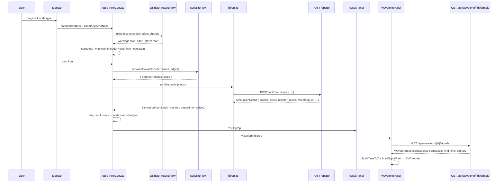

> **中文版**: [04-frontend.md](zh-TW/04-frontend.md)

# Frontend: React Flow Canvas Editor for I2C Protocol Simulation

## TL;DR

- The application is a single-page React 19 + TypeScript app built with Vite and styled with Tailwind CSS (`frontend/package.json:13-17`).
- The central component `App` in `frontend/src/App.tsx` owns all state: canvas nodes/edges, simulation result, panel sizes, and viewport persistence.
- Users construct an I2C protocol sequence by placing and connecting five custom node types on a React Flow canvas; the flow is serialized to a `steps` array via DFS over the longest connected chain (`frontend/src/lib/serialize.ts:153-189`).
- Protocol validation runs on every canvas change and writes warnings into `node.data.warning` without blocking the user (`frontend/src/lib/protocol-validate.ts:113-252`).
- After simulation, `WaveformPanel` fetches VCD signal data from `GET /api/waveform/{id}/signals` and renders SVG step traces with independent pan/zoom (`frontend/src/components/WaveformPanel.tsx:345-873`).

---

## 1. Overview

The frontend is a visual protocol builder that lets engineers construct I2C sequences as a directed flow graph, submit them to the simulation backend, and inspect timing waveforms and per-step results without writing code.

### Responsibilities

1. **Canvas editing** — React Flow canvas with free-placement, drag-and-drop from sidebar, manual edge drawing, and Delete/Backspace key removal.
2. **Serialization** — Convert the canvas graph into the `{ steps: [...] }` payload expected by `POST /api/run` via a topological DFS.
3. **Client-side validation** — Two layers: field-level hex validation blocks the Run button; protocol-structural validation adds warning badges to nodes.
4. **Simulation dispatch** — `runSimulation()` in `frontend/src/lib/api.ts:80` POSTs the step list and normalises the response.
5. **Result rendering** — `ResultPanel` shows per-step pass/fail with master/slave columns and a 256-byte EEPROM hex dump; `WaveformPanel` renders VCD signal traces.
6. **Persistence** — `useFlowAutosave` debounces writes to `localStorage` every 500 ms under the key `i2c-demo-flow` (`frontend/src/lib/useFlowPersistence.ts:4,48-75`).

### Module boundaries

| Layer | Files | Role |
|-------|-------|------|
| Entry | `frontend/src/main.tsx` | Mounts `<App>` into `#root` |
| App shell | `frontend/src/App.tsx` | All state; layout; run orchestration |
| Custom nodes | `frontend/src/components/nodes/` | Renderable React Flow node components |
| UI chrome | `frontend/src/components/` | Toolbar, Sidebar, ResultPanel, WaveformPanel, ResizeHandle |
| Library | `frontend/src/lib/` | Serialization, validation, API, persistence, waveform helpers |

### API base URL

`API_BASE` is resolved at build time from `import.meta.env.VITE_API_URL`, falling back to `/api` when the variable is absent (`frontend/src/lib/api.ts:3`). In development the Vite dev server proxies `/api` to the FastAPI backend at `localhost:8000`.

---

## 2. Data Flow



### Key data shapes at each boundary

| Boundary | Shape | Evidence |
|----------|-------|----------|
| Canvas node data | `{ data: string }` (send_byte) or `{ ack: boolean }` (recv_byte) plus optional `status`, `warning`, `addrHelper` | `frontend/src/lib/serialize.ts:5-13` |
| `serializeFlow` output | `StepPayload[]` — union of `StartStep`, `StopStep`, `RepeatedStartStep`, `SendByteStep`, `RecvByteStep` | `frontend/src/lib/serialize.ts:24-51` |
| `POST /api/run` body | `{ "steps": StepPayload[] }` | `frontend/src/lib/api.ts:83-85` |
| `SimulationResult` | `{ passed, steps: StepResult[], register_dump, reg_pointer, waveform_id?, sim_time_total_ps? }` | `frontend/src/lib/api.ts:30-43` |
| `WaveformSignalsResponse` | `{ timescale, end_time, signals: Record<string, { width, changes: [number, string][] }> }` | `frontend/src/lib/api.ts:148-152` |
| `localStorage` key | `"i2c-demo-flow"` → `{ nodes, edges, viewport }` | `frontend/src/lib/useFlowPersistence.ts:4,6-10` |

---

## 3. Code Map

| Component | File Path | Evidence Location | Description |
|-----------|-----------|-------------------|-------------|
| `App` (default export) | `frontend/src/App.tsx` | `:285-652` | Root component; owns nodes/edges state, panel sizes, run logic, and viewport-restore flag; renders the full layout |
| `FlowCanvas` | `frontend/src/App.tsx` | `:203-283` | Inner component (child of `ReactFlowProvider`); calls `useReactFlow()` for viewport and autosave; handles drag-over/drop |
| `applyVerticalLayout` | `frontend/src/App.tsx` | `:59-72` | Normalises all nodes to a single x column (`LAYOUT_X=100`) spaced `NODE_HEIGHT + GAP` apart; strips post-simulation tooltips and widths |
| `buildAutoEdges` | `frontend/src/App.tsx` | `:79-87` | Produces smoothstep edges with `MarkerType.ArrowClosed` between every consecutive pair in an ordered nodes array |
| `nodeTypes` registry | `frontend/src/App.tsx` | `:91-97` | Maps type strings (`i2c_start`, `i2c_stop`, `repeated_start`, `send_byte`, `recv_byte`) to their React components |
| `handleRun` | `frontend/src/App.tsx` | `:544-591` | Calls `serializeFlowWithOrder`, POSTs via `runSimulation`, maps result steps back to node IDs for status badges |
| `onNodesChange` | `frontend/src/App.tsx` | `:381-435` | Distinguishes position-only vs structural changes; bridges edges around deleted nodes without re-layout |
| `templateToNodesAndEdges` | `frontend/src/App.tsx` | `:154-173` | Converts a template `steps` array into React Flow nodes using `opToNodeType` + `stepToNodeData`, then applies vertical layout |
| `Toolbar` | `frontend/src/components/Toolbar.tsx` | `:11-33` | Header bar with title, `TemplateDropdown`, Clear button, and Run button (disabled when `isRunDisabled` or `isRunning`) |
| `TemplateDropdown` | `frontend/src/components/TemplateDropdown.tsx` | `:11-128` | Lazy-fetches `GET /api/templates` on first open; renders a listbox; calls `onSelect` with the chosen template ID |
| `Sidebar` | `frontend/src/components/Sidebar.tsx` | `:48-62` | Fixed-width left panel listing all five node types; each item is both clickable (append) and draggable (free drop) |
| `ResizeHandle` | `frontend/src/components/ResizeHandle.tsx` | `:16-97` | Drag-resize strip between adjacent flex panels; supports both `horizontal` and `vertical` orientations |
| `ResultPanel` | `frontend/src/components/ResultPanel.tsx` | `:194-299` | Collapsible right panel; renders `EepromDump` (256-byte hex table) and `StepTable` (per-step pass/fail with master/slave columns) |
| `WaveformPanel` | `frontend/src/components/WaveformPanel.tsx` | `:345-873` | Bottom panel; fetches signals, manages `selectedSignals`, renders SVG traces via `buildSignalPath`; supports wheel zoom and drag-to-pan |
| `SignalPicker` | `frontend/src/components/WaveformPanel.tsx` | `:207-336` | Popup search UI for adding additional signals to the waveform view |
| `StartNode` | `frontend/src/components/nodes/StartNode.tsx` | `:13-58` | Source-only node (bottom handle only); green theme; shows warning badge or pass/fail status |
| `StopNode` | `frontend/src/components/nodes/StopNode.tsx` | `:13-58` | Target-only node (top handle only); rose theme |
| `RepeatedStartNode` | `frontend/src/components/nodes/RepeatedStartNode.tsx` | `:13-66` | Source+target handles; orange theme; valid only when preceded by a Start in chain |
| `SendByteNode` | `frontend/src/components/nodes/SendByteNode.tsx` | `:33-131` | Source+target handles; purple theme; hex input with `validateHexByte`; shows decoded address helper (`addrHelper`) from protocol validation |
| `RecvByteNode` | `frontend/src/components/nodes/RecvByteNode.tsx` | `:15-105` | Source+target handles; teal theme; ACK/NACK dropdown; read-only `receivedData` field populated post-simulation |
| `serializeFlow` | `frontend/src/lib/serialize.ts` | `:204-206` | Public entry point; returns `StepPayload[]` for the longest connected chain |
| `serializeFlowWithOrder` | `frontend/src/lib/serialize.ts` | `:214-218` | Same as `serializeFlow` but also returns parallel `orderedNodeIds[]` for mapping results back to canvas nodes |
| `mapNodeToStep` | `frontend/src/lib/serialize.ts` | `:118-144` | Converts one `FlowNode` to its `StepPayload`; calls `formatHex` for `send_byte` data normalisation |
| `formatHex` | `frontend/src/lib/serialize.ts` | `:60-66` | Normalises hex input (`"50"`, `"0x50"`, `"0X50"`) to canonical `"0xNN"` uppercase form |
| `validateProtocolFlow` | `frontend/src/lib/protocol-validate.ts` | `:113-252` | Walks the longest chain; state-machine checks for missing Stop, misplaced data bytes, and R/W direction mismatches; returns `warnings` and `addrHelpers` maps |
| `validateHexByte` | `frontend/src/lib/validate.ts` | `:14-23` | Field-level validator; rejects empty, non-hex, and out-of-range (> 0xFF) values; used by `SendByteNode` |
| `chainHasErrors` | `frontend/src/lib/validate.ts` | `:30-34` | Returns `true` if any node's `errors` object contains a non-empty string; used to gate the Run button |
| `runSimulation` | `frontend/src/lib/api.ts` | `:80-103` | POSTs to `POST /api/run`; normalises per-step `status` → `passed` boolean |
| `getTemplate` | `frontend/src/lib/api.ts` | `:122-131` | Fetches `GET /api/templates/{id}` and returns the full `TemplateDetail` including steps |
| `getWaveformSignals` | `frontend/src/lib/api.ts` | `:163-180` | Fetches `GET /api/waveform/{id}/signals`; accepts optional signal names filter |
| `loadPersistedFlow` / `clearPersistedFlow` | `frontend/src/lib/useFlowPersistence.ts` | `:13-39` | Reads/removes `localStorage["i2c-demo-flow"]` with shape validation |
| `useFlowAutosave` | `frontend/src/lib/useFlowPersistence.ts` | `:48-75` | `useEffect` hook that debounces writes to `localStorage` 500 ms after the last nodes/edges change |
| `buildTimeToX` | `frontend/src/lib/waveform.ts` | `:82-90` | Factory that returns a `(timePs) => xPx` linear mapping; shared between `WaveformPanel` and canvas layout |
| `buildSignalPath` | `frontend/src/components/WaveformPanel.tsx` | `:27-62` | Builds an SVG path string of horizontal and vertical segments from a `[time_ps, value]` change list |

---

## 4. Troubleshooting

### Problem: Run button stays disabled despite nodes on the canvas

**Symptoms**
- The Run button is grey and cannot be clicked.
- The canvas has nodes, but no edges connect them, or a `SendByteNode` shows a red-bordered input.

**Possible Causes (most likely first)**
1. No edges exist — `hasConnectedChain(edges)` returns `false` when `edges.length === 0` (`frontend/src/App.tsx:186-188`). Nodes must be connected by at least one edge.
2. A `SendByteNode` carries a field validation error — `nodesHaveErrors(nodes)` reads `node.data.errors` for every node and returns `true` if any error string is non-empty (`frontend/src/App.tsx:195-200`).
3. A simulation is already in flight (`isRunning === true`).

**Check Locations**
- Gate condition: `frontend/src/App.tsx:522` (`isRunDisabled` assignment)
- Field validation: `frontend/src/lib/validate.ts:14-23` (`validateHexByte`)
- Error propagation into node data: `frontend/src/components/nodes/SendByteNode.tsx:41-44`

**Fix Direction**
- Draw an edge between nodes by dragging from one node's bottom handle to the next node's top handle.
- Correct the hex value in the `SendByteNode` input (accepted forms: `0xA0`, `A0`, `a0`).

---

### Problem: Protocol warning badges appear on nodes unexpectedly

**Symptoms**
- Node headers turn yellow and display a `!` badge.
- Warning text such as "Send Byte must be between Start and Stop" or "Recv Byte used in write mode" appears inside the node.

**Possible Causes (most likely first)**
1. A `send_byte` or `recv_byte` node is placed outside a Start–Stop segment in the longest chain.
2. The R/W direction implied by the address byte (first `send_byte` after Start) conflicts with subsequent data nodes — e.g., `recv_byte` after an address byte with LSB=0.
3. A `repeated_start` node is present without a preceding Start condition.

**Check Locations**
- State-machine logic: `frontend/src/lib/protocol-validate.ts:143-249`
- Warning injection into node data: `frontend/src/App.tsx:355-372`
- Warning display in nodes: `frontend/src/components/nodes/StartNode.tsx:26-31` (pattern shared by all five node types)

**Fix Direction**
- Ensure the sequence is: `i2c_start` → (optional address `send_byte`) → data bytes → `i2c_stop`.
- For read transactions, the address byte must have LSB=1 (e.g., `0xA1`); follow it with `recv_byte` nodes.
- For write transactions, the address byte must have LSB=0 (e.g., `0xA0`); follow it with `send_byte` nodes.

---

### Problem: Waveform panel shows "Failed to load waveform signals" or no traces

**Symptoms**
- The waveform panel header shows an error message after a successful run.
- The panel body is blank despite `waveform_id` being present in the simulation result.

**Possible Causes (most likely first)**
1. The VCD file was never written or has already expired on the backend (default TTL: 30 minutes). See `docs/03-backend-api.md` Troubleshooting for backend-side diagnosis.
2. The `DEFAULT_SIGNALS` list (`['sda', 'scl']`) contains signal names absent from the VCD; the initial fetch requesting all signals succeeds but individual signals may not match (`frontend/src/components/WaveformPanel.tsx:23,482-493`).
3. A network error prevents the `GET /api/waveform/{id}/signals` call from completing.

**Check Locations**
- Fetch effect: `frontend/src/components/WaveformPanel.tsx:468-505`
- Error display path: `WaveformPanel.tsx:496-497`
- Default signals constant: `WaveformPanel.tsx:23`

**Fix Direction**
- Verify that `POST /api/run` returned a non-null `waveform_id` by inspecting the browser Network tab.
- If the VCD file expired, re-run the simulation.
- Use the "open in Surfer" or "download VCD" links in the panel header to confirm the file is accessible (`WaveformPanel.tsx:611-628`).

---

### Problem: Canvas state is lost after a page reload

**Symptoms**
- All nodes and edges disappear on refresh.
- `localStorage["i2c-demo-flow"]` is absent or malformed.

**Possible Causes (most likely first)**
1. `localStorage` quota was exceeded during a save; the quota error is silently swallowed (`frontend/src/lib/useFlowPersistence.ts:69`).
2. The browser is in private/incognito mode where `localStorage` is cleared on close.
3. The user or another tab called `clearPersistedFlow()` (triggered by the Clear button at `frontend/src/App.tsx:515`).

**Check Locations**
- Autosave hook: `frontend/src/lib/useFlowPersistence.ts:48-75`
- Restore on mount: `frontend/src/App.tsx:288-295`
- Storage key: `frontend/src/lib/useFlowPersistence.ts:4`

**Fix Direction**
- Open `localStorage` in DevTools → Application → Storage; check whether the `i2c-demo-flow` key exists and is valid JSON with `nodes`, `edges`, and `viewport` fields.
- If quota is the issue, reduce canvas complexity or clear other `localStorage` entries.

---

### Problem: Template load replaces the canvas silently

**Symptoms**
- Clicking a template in the dropdown discards the current canvas without confirmation when the canvas is empty; with content, the browser shows a confirm dialog that can be missed.

**Possible Causes**
1. The canvas is empty (`nodes.length === 0 && edges.length === 0`) so the guard is skipped (`frontend/src/App.tsx:526`).

**Check Locations**
- Guard logic: `frontend/src/App.tsx:524-528`

**Fix Direction**
- To always prompt, remove the empty-canvas short-circuit condition at `App.tsx:526`.

---

## 5. Extension Guide

### Adding a new node type

**What to add**: A new I2C operation represented as a canvas node (e.g., a "Delay" node).

**New files to create**:
- `frontend/src/components/nodes/DelayNode.tsx` — follow the pattern of `SendByteNode.tsx`. Include `Handle` components at `Position.Top` (`type="target"`) and `Position.Bottom` (`type="source"`). Add a `DelayNodeData` interface with the node's editable fields. Use `useReactFlow().setNodes` inside `onChange` handlers.

**Existing files to modify**:

1. `frontend/src/components/nodes/index.ts` — export the new component (follows the existing re-export pattern).

2. `frontend/src/App.tsx:91-97` — register the new type in `nodeTypes`:
   ```ts
   // frontend/src/App.tsx:91-97
   const nodeTypes: NodeTypes = {
     i2c_start: StartNode,
     i2c_stop: StopNode,
     repeated_start: RepeatedStartNode,
     send_byte: SendByteNode,
     recv_byte: RecvByteNode,
     delay: DelayNode,           // add here
   }
   ```

3. `frontend/src/App.tsx:100-113` — add a `case 'delay'` to `buildDefaultData` with the appropriate defaults.

4. `frontend/src/App.tsx:120-129` — add a `case 'delay'` to `opToNodeType` mapping the backend op name back to the canvas type.

5. `frontend/src/lib/serialize.ts:118-144` — add a `case 'delay'` to `mapNodeToStep` that returns the correct `StepPayload` shape.

6. `frontend/src/components/Sidebar.tsx:8-14` — append an entry to `PROTOCOL_NODE_TYPES`:
   ```ts
   // frontend/src/components/Sidebar.tsx:8-14
   { type: 'delay', label: 'Delay', color: '#64748b', description: 'Insert a timed delay' },
   ```

7. `frontend/src/lib/protocol-validate.ts:148-239` — add a `case 'delay'` to the switch in `validateProtocolFlow` if the new type has protocol-structural constraints; otherwise the default silent-ignore path already handles it.

**Reference implementation**: `frontend/src/components/nodes/SendByteNode.tsx:33-131` for a node with editable fields and validation; `frontend/src/components/nodes/StartNode.tsx:13-58` for a no-data node.

---

### Adding a new API call

**What to add**: A typed wrapper function for a new backend endpoint.

**Existing files to modify**: `frontend/src/lib/api.ts` — follow the pattern of `getWaveformSignals` (`api.ts:163-180`):

1. Define a TypeScript interface for the response shape.
2. Build the URL using `new URL(...)` to handle encoding.
3. Call `fetch`, check `response.ok`, extract the error message via `extractErrorMessage` on failure (`api.ts:63-72`), and return the typed JSON.

---

### Extending the ResultPanel with a new section

**What to add**: An additional display section in the result panel (e.g., timing statistics).

**Existing files to modify**: `frontend/src/components/ResultPanel.tsx:256-295` — add a new section inside the `isExpanded` body. The panel uses a flex-column layout: the `EepromDump` block is `flex-shrink-0` (always visible), followed by a scrollable step-results area. New sections can be inserted between them or appended below.

**Data available**: All fields of `SimulationResult` are accessible from the `result` prop (`frontend/src/components/ResultPanel.tsx:4`). The `sim_time_total_ps` field is available at `result.sim_time_total_ps` (`frontend/src/lib/api.ts:42`).

---

### Changing the canvas persistence key or debounce delay

**Existing file to modify**: `frontend/src/lib/useFlowPersistence.ts`

- Storage key: `FLOW_STORAGE_KEY` at `useFlowPersistence.ts:4` — change the string to namespace to a different browser storage slot.
- Debounce delay: the `setTimeout` at `useFlowPersistence.ts:60` uses a hardcoded `500` ms — change this number to adjust how quickly the canvas is saved after the last edit.

---

## Assumptions / To Be Confirmed

- `ASSUMPTION:` The `nodes/index.ts` re-export barrel (`frontend/src/components/nodes/index.ts`) was verified to exist but not read in full; its exports are inferred from the import at `App.tsx:22-27`. It is assumed to re-export all five node components.
- `ASSUMPTION:` The Surfer waveform viewer referenced at `WaveformPanel.tsx:611` (`/surfer/index.html`) is a separately deployed static asset. Its presence or absence was not verified; if absent, the "open in Surfer" link will return 404 but does not affect waveform rendering within the panel.
- `ASSUMPTION:` The `VITE_API_URL` environment variable used at `api.ts:3` is not set in the repository's `.env` files (none were found). In development the default `/api` path relies on a Vite proxy configured in `vite.config.ts` (not read); in production, the backend must be served from the same origin or the variable must be set at build time.

---

## Related Files Index

- `/home/linrswa/dev/verilog/i2c_lab/frontend/src/App.tsx`
- `/home/linrswa/dev/verilog/i2c_lab/frontend/src/main.tsx`
- `/home/linrswa/dev/verilog/i2c_lab/frontend/src/components/Toolbar.tsx`
- `/home/linrswa/dev/verilog/i2c_lab/frontend/src/components/Sidebar.tsx`
- `/home/linrswa/dev/verilog/i2c_lab/frontend/src/components/ResultPanel.tsx`
- `/home/linrswa/dev/verilog/i2c_lab/frontend/src/components/WaveformPanel.tsx`
- `/home/linrswa/dev/verilog/i2c_lab/frontend/src/components/ResizeHandle.tsx`
- `/home/linrswa/dev/verilog/i2c_lab/frontend/src/components/TemplateDropdown.tsx`
- `/home/linrswa/dev/verilog/i2c_lab/frontend/src/components/nodes/StartNode.tsx`
- `/home/linrswa/dev/verilog/i2c_lab/frontend/src/components/nodes/StopNode.tsx`
- `/home/linrswa/dev/verilog/i2c_lab/frontend/src/components/nodes/RepeatedStartNode.tsx`
- `/home/linrswa/dev/verilog/i2c_lab/frontend/src/components/nodes/SendByteNode.tsx`
- `/home/linrswa/dev/verilog/i2c_lab/frontend/src/components/nodes/RecvByteNode.tsx`
- `/home/linrswa/dev/verilog/i2c_lab/frontend/src/components/nodes/index.ts`
- `/home/linrswa/dev/verilog/i2c_lab/frontend/src/lib/api.ts`
- `/home/linrswa/dev/verilog/i2c_lab/frontend/src/lib/serialize.ts`
- `/home/linrswa/dev/verilog/i2c_lab/frontend/src/lib/serialize.test.ts`
- `/home/linrswa/dev/verilog/i2c_lab/frontend/src/lib/protocol-validate.ts`
- `/home/linrswa/dev/verilog/i2c_lab/frontend/src/lib/validate.ts`
- `/home/linrswa/dev/verilog/i2c_lab/frontend/src/lib/waveform.ts`
- `/home/linrswa/dev/verilog/i2c_lab/frontend/src/lib/useFlowPersistence.ts`
- `/home/linrswa/dev/verilog/i2c_lab/frontend/package.json`
- `/home/linrswa/dev/verilog/i2c_lab/docs/03-backend-api.md`
