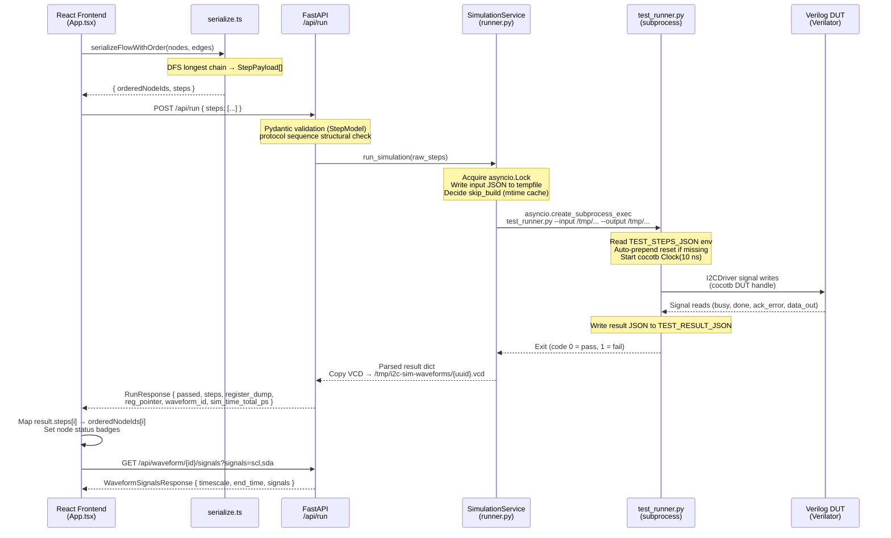

> **English version**: [00-architecture.md](../00-architecture.md)

# 系統架構：全端 I2C 模擬平台

## 摘要

- 四層架構：React Flow 前端 → FastAPI 後端 → cocotb 模擬子程序 → Verilog RTL（DUT）
- 關鍵的 IPC 邊界位於 FastAPI 和模擬器之間：`SimulationService.run_simulation()` 將步驟寫入暫存 JSON 檔案，透過 `asyncio.create_subprocess_exec` 啟動 `test_runner.py` 作為子程序，並從第二個暫存 JSON 檔案讀取結果（`backend/app/services/runner.py:106-173`）
- 主要模擬進入點是 `backend/sim/test_runner.py:817` 中的 `test_i2c_sequence()`，它從環境變數讀取 `TEST_STEPS_JSON` 並將結果寫入 `TEST_RESULT_JSON`
- Verilog 匯流排使用輸出致能（OE）+ 線與（wired-AND）模型，而非 `inout`/三態，這是 Verilator 相容性的必要條件（`backend/sim/rtl/i2c_top.v:39-41`）
- `SimulationService` 內的單一 `asyncio.Lock` 將所有並行模擬請求序列化；等待超過 120 秒的呼叫端將收到 HTTP 503（`backend/app/services/runner.py:71,35`）

---

## 1. 概述

本平台讓使用者在 React Flow 畫布上以視覺化方式組合 I2C 協定序列，並對真實的 Verilog RTL 進行模擬執行。結果——每步的通過/失敗狀態、暫存器傾印（register dump）和 VCD 波形——會回傳至前端顯示。

### 各層職責

| 層級 | 技術 | 角色 |
|------|------|------|
| 前端 | Vite + React + React Flow (`@xyflow/react`) | 視覺化 I2C 協定建構器、步驟序列化、結果顯示、波形檢視器 |
| 後端 API | FastAPI (Python) + uvicorn | REST 端點、子程序編排、VCD 儲存、並行控制 |
| 模擬引擎 | cocotb 2.0 + `cocotb_tools.runner`（Verilator 或 Icarus） | RTL 時脈/重設驅動、I2C 訊號產生、結果擷取 |
| RTL | Verilog（相容 SystemVerilog） | I2C 主控 FSM、從端暫存器檔案、OE 匯流排模型 |

### 元件拓撲

```
┌─────────────────────┐       HTTP/JSON         ┌──────────────────────────┐
│  Frontend           │ ──────────────────────> │  FastAPI (port 8000)     │
│  localhost:5173     │ <─────────────────────  │  backend/app/main.py     │
│  Vite + React Flow  │                         │  /api/run                │
└─────────────────────┘                         │  /api/waveform/{id}      │
                                                │  /api/templates          │
                                                └────────────┬─────────────┘
                                                             │ asyncio.create_subprocess_exec
                                                             │ (temp JSON files)
                                                             ▼
                                                ┌──────────────────────────┐
                                                │  test_runner.py          │
                                                │  backend/sim/            │
                                                │  cocotb 2.0 + Verilator  │
                                                └────────────┬─────────────┘
                                                             │ cocotb DUT handle
                                                             ▼
                                                ┌──────────────────────────┐
                                                │  i2c_system_wrapper.v    │
                                                │  └── i2c_top.v           │
                                                │      ├── i2c_master.v    │
                                                │      └── i2c_slave.v     │
                                                └──────────────────────────┘
```

### 模組邊界

- `backend/app/` 使用 `sim.` 前綴匯入（例如 `from sim.protocol_interpreter import validate_protocol_sequence`，位於 `backend/app/routes/simulation.py:14`）
- `backend/sim/` 使用裸匯入（例如 `from i2c_driver import I2CDriver`，位於 `backend/sim/test_runner.py:102`），因為子程序以 `cwd=sim/` 執行
- 前端僅透過 `frontend/src/lib/api.ts` 通訊；所有 API 基底 URL 解析發生在 `frontend/src/lib/api.ts:3`（`VITE_API_URL || '/api'`）

---

## 2. 資料流

### 請求生命週期：從 UI 到模擬再到結果



### 協定與格式細節

| 邊界 | 協定 / 格式 | Key Location |
|------|-------------|--------------|
| 瀏覽器 → FastAPI | HTTP POST JSON `{ "steps": [...] }` | `frontend/src/lib/api.ts:81-85` |
| FastAPI → 子程序 | `asyncio.create_subprocess_exec` + 兩個暫存 `.json` 檔案 | `backend/app/services/runner.py:215-229` |
| 輸入暫存檔案結構 | `{ "steps": [ {"op": "...", ...} ] }` | `backend/app/services/runner.py:161` |
| 輸出暫存檔案結構 | `{ "passed": bool, "steps": [...], "register_dump": {...}, "reg_pointer": int, "vcd_path": str, "sim_time_total_ps": int }` | `backend/sim/test_runner.py:761-768` |
| Steps 環境變數 | `TEST_STEPS_JSON`（JSON 編碼的列表） | `backend/sim/test_runner.py:835` |
| Result 環境變數 | `TEST_RESULT_JSON`（檔案路徑） | `backend/sim/test_runner.py:871` |
| VCD 儲存 | `tmpdir/i2c-sim-waveforms/{uuid}.vcd`（30 分鐘 TTL） | `backend/app/services/waveform.py:21-23` |
| VCD 訊號 API | `GET /api/waveform/{id}/signals?signals=scl,sda` | `backend/app/routes/simulation.py:209` |

### IPC JSON 結構定義

**輸入檔案**（`/tmp/i2c_sim_input_*.json`）：

```json
{
  "steps": [
    { "op": "reset" },
    { "op": "start" },
    { "op": "send_byte", "data": "0xA0" },
    { "op": "send_byte", "data": "0x00" },
    { "op": "recv_byte", "ack": false },
    { "op": "stop" }
  ]
}
```

**輸出檔案**（`/tmp/i2c_sim_output_*.json`）：

```json
{
  "passed": true,
  "steps": [
    { "op": "start", "status": "ok", "time_range_ps": [1000, 2500] },
    { "op": "send_byte", "data": "0xa0", "addr": "0x50", "rw": "write", "status": "ok", "time_range_ps": [2500, 12000] },
    { "op": "send_byte", "data": "0x0", "status": "ok", "time_range_ps": [12000, 21500] },
    { "op": "recv_byte", "ack": false, "data": "0xff", "status": "ok", "time_range_ps": [21500, 31000] },
    { "op": "stop", "status": "ok", "time_range_ps": [31000, 32000] }
  ],
  "register_dump": { "0": 255 },
  "reg_pointer": 0,
  "vcd_path": "i2c_system_cocotb.vcd",
  "sim_time_total_ps": 32000
}
```

---

## 3. 程式碼對照表

| 元件 | File Path | 關鍵函式 / 類別 | Evidence Location | 說明 |
|------|-----------|----------------|-------------------|------|
| 應用程式根元件與執行處理器 | `frontend/src/App.tsx` | `App`, `handleRun` | `App.tsx:285,544` | 管理所有畫布狀態；呼叫 `serializeFlowWithOrder` 然後 `runSimulation`；將結果步驟對應回節點 ID |
| Flow 序列化器 | `frontend/src/lib/serialize.ts` | `serializeFlowWithOrder` | `serialize.ts:214` | 對 React Flow 圖形進行 DFS 最長鏈遍歷 → 產生排序後的 `StepPayload[]` 供 API 使用 |
| 前端 API 客戶端 | `frontend/src/lib/api.ts` | `runSimulation`, `getWaveformSignals` | `api.ts:80,163` | 具型別的 fetch 包裝函式；將回應中的 `status` 正規化為 `passed` |
| FastAPI 進入點 | `backend/app/main.py` | `app`, `lifespan` | `main.py:27,14` | 掛載路由器，在 lifespan 啟動時啟動 VCD TTL 清理任務 |
| 模擬路由 | `backend/app/routes/simulation.py` | `run_simulation`（路由） | `simulation.py:100` | 驗證請求、分配波形 UUID、呼叫 `SimulationService`、複製 VCD |
| 模擬服務 | `backend/app/services/runner.py` | `SimulationService.run_simulation` | `runner.py:106` | 取得 `asyncio.Lock`，讀寫暫存 JSON 檔案，管理建置快取 mtime |
| 子程序啟動器 | `backend/app/services/runner.py` | `SimulationService._invoke_runner` | `runner.py:179` | 使用 `sys.executable` 組裝 CLI 命令，呼叫 `asyncio.create_subprocess_exec`，強制 60 秒逾時 |
| cocotb 測試進入點 | `backend/sim/test_runner.py` | `test_i2c_sequence` | `test_runner.py:817` | cocotb 協程：讀取環境變數、自動前置 reset、啟動 `Clock(10 ns)`、呼叫 `run_sequence` |
| 模擬執行器 API | `backend/sim/test_runner.py` | `run_simulation` | `test_runner.py:888` | 呼叫 `cocotb_tools.runner` 建置與測試；設定 Verilator 旗標 `--trace --public-flat-rw --timing` |
| 步驟解析器 | `backend/sim/test_runner.py` | `parse_sequence`, `parse_step` | `test_runner.py:333,242` | 對照 `VALID_OPS` 驗證操作名稱；將十六進位字串轉換為整數 |
| 步驟執行器 | `backend/sim/test_runner.py` | `execute_sequence` | `test_runner.py:619` | 立即派發舊式操作；將協定操作緩衝在 `start`/`stop` 之間，交由 `ProtocolInterpreter` 處理 |
| VCD 波形儲存 | `backend/app/services/waveform.py` | `allocate_vcd_path`, `start_cleanup_task` | `waveform.py:32,82` | 以 UUID 命名的檔案存放於 `tmpdir/i2c-sim-waveforms/`；背景 30 分鐘 TTL 清理 |
| 線與匯流排 | `backend/sim/rtl/i2c_top.v` | `sda`, `scl` wires | `i2c_top.v:39-41` | OE + 線與模型：`sda = ~(master_sda_oe \| slave_sda_oe)`；避免三態以相容 Verilator |
| 測試平台包裝器 | `backend/sim/tb/i2c_system_wrapper.v` | `i2c_system_wrapper` | `i2c_system_wrapper.v:3` | 頂層 cocotb DUT；包裝 `i2c_top`；僅在 Icarus 下有條件地使用 `$dumpfile` |

---

## 4. 疑難排解

### 問題：模擬掛起並在逾時後被終止

**症狀**
- `POST /api/run` 回傳 HTTP 500，訊息為「Simulation timed out after 60 seconds」
- 子程序在產生任何輸出 JSON 之前就被 `process.kill()` 終止

**可能原因**
1. 缺少 reset 步驟——DUT 訊號在首次使用時處於未定義狀態；cocotb 無限期等待 `done`/`busy`
2. RTL FSM 卡在無法離開的狀態（例如等待永遠不會到來的 ACK，因為位址不匹配）
3. Verilator 二進位檔在建置時未加上 `--timing`，導致所有 `await` 觸發器永遠不會觸發

**檢查位置**
- 自動前置邏輯：`backend/sim/test_runner.py:844-849`（驗證是否在缺少時注入 reset）
- 逾時終止程式碼：`backend/app/services/runner.py:235-244`
- Verilator 建置旗標：`backend/sim/test_runner.py:948-956`

**修正方向**
- 確保第一個步驟是 `reset`，或依賴 `test_runner.py:847` 的自動前置功能
- 如果缺少 `--timing`，將其加入 Verilator 建置旗標
- 檢查從端位址設定：`i2c_system_wrapper.v:6` 設定 `SLAVE_ADDR = 7'h50`

---

### 問題：`POST /api/run` 回傳 HTTP 503

**症狀**
- 瀏覽器收到 `503 Service Unavailable`，訊息為「Server is busy」
- 來自同一或不同客戶端的多個同時請求

**可能原因**
1. 前一個模擬仍在執行中（Verilator 編譯 + 模擬可能需要數秒）
2. 一個卡住的模擬持有鎖直到 60 秒子程序逾時觸發，阻塞後續請求最多 `QUEUE_TIMEOUT = 120` 秒

**檢查位置**
- 鎖定與佇列逾時：`backend/app/services/runner.py:71,35,143-151`
- 路由錯誤處理：`backend/app/routes/simulation.py:135-136`

**修正方向**
- 減少 `runner.py:31,35` 中的 `DEFAULT_TIMEOUT` 或 `QUEUE_TIMEOUT` 常數以加速故障轉移
- 啟用建置快取（透過 `runner.py:93-104` 的 RTL mtime 檢查自動運作）以降低每次請求的成本

---

### 問題：波形下載回傳 404

**症狀**
- `GET /api/waveform/{id}` 在成功模擬後回傳 404
- 前端的波形面板未顯示任何訊號

**可能原因**
1. VCD 檔案已過期並被背景清理任務刪除（預設 30 分鐘 TTL）
2. 模擬器未產生 VCD——例如 Verilator 建置時未使用 `--trace`
3. 從 `sim_build/` 複製 VCD 到管理儲存區時因 `OSError` 而靜默失敗（在 `simulation.py:158-159` 被捕獲）

**檢查位置**
- VCD TTL 與清理：`backend/app/services/waveform.py:14,42-62`
- VCD 複製步驟：`backend/app/routes/simulation.py:151-159`
- 僅限 Icarus 的 `$dumpfile`：`backend/sim/tb/i2c_system_wrapper.v:52-56`

**修正方向**
- 透過 `VCD_TTL_MINUTES` 環境變數增加 TTL（預設 30）
- 驗證 `--trace` 是否存在於 `test_runner.py:948-956` 的 Verilator 建置參數中
- 檢查子程序的 stderr 以查看複製失敗；`runner.py:262-266` 的 `RuntimeError` 會將其呈現

---

### 問題：子程序以非零代碼退出但無結果 JSON

**症狀**
- `POST /api/run` 回傳 HTTP 500，訊息為「produced no result JSON」
- `test_runner.py` 的 stderr 包含在錯誤訊息中

**可能原因**
1. RTL 編譯失敗（缺少 Verilog 原始碼、`.v` 檔案中的語法錯誤）
2. `test_runner.py` 或其相依套件（`i2c_driver.py`、`protocol_interpreter.py`）發生 Python 匯入錯誤
3. 子程序使用了錯誤的 Python 直譯器（非 `.venv` 中的），因此 cocotb 未安裝

**檢查位置**
- 子程序命令建構：`backend/app/services/runner.py:215-220`（使用 `sys.executable`）
- Stderr 呈現：`backend/app/services/runner.py:261-266`
- RTL 原始碼列表：`backend/sim/test_runner.py:155-160`

**修正方向**
- 務必使用 `.venv` 的 Python 啟動後端：`source .venv/bin/activate && cd backend && python3 -m uvicorn app.main:app ...`
- 這確保 `runner.py:216` 的 `sys.executable` 指向已安裝 cocotb 的虛擬環境 Python

---

## 5. 擴充指南

### 新增 I2C 操作類型

`op` 欄位會經過五個層級。每一層都需要修改：

1. **將操作名稱加入 `VALID_OPS`**，位於 `backend/sim/test_runner.py:217-231`，以及 `_VALID_OPS`，位於 `backend/app/routes/simulation.py:23-28`
2. **實作 `parse_step` 處理**，位於 `backend/sim/test_runner.py:242-330`——新增一個 `elif op == "new_op":` 分支來正規化參數
3. **實作執行處理**——舊式操作（如 `write_bytes`）由 `backend/sim/test_runner.py:360-457` 中的 `execute_step` 直接派發；協定操作（如 `send_byte`）在 `start`..`stop` 之間被緩衝，並由 `execute_sequence` 透過 `ProtocolInterpreter` 處理，結果建構位於 `test_runner.py:580-596`
4. **建立對應的 React Flow 節點類型**，放在 `frontend/src/components/nodes/` 下，遵循 `SendByteNode` 的模式
5. **註冊節點類型**，位於 `frontend/src/App.tsx:91-97`（`nodeTypes` 對應表），並在 `frontend/src/lib/serialize.ts:118-144` 的 `mapNodeToStep` 中新增一個 case
6. **新增 Pydantic 模型欄位**，位於 `backend/app/routes/simulation.py:39-44`，如果該操作有需要驗證的酬載欄位（目前使用 `extra = "allow"`）

參考實作：`send_byte` 是最簡單的帶參數協定操作——解析位於 `test_runner.py:292-300`，執行位於 `test_runner.py:580-596`（在 `execute_sequence` 內），前端位於 `serialize.ts:131-134`。注意：協定操作如果直接到達 `execute_step` 會引發 `ValueError`（約第 396-404 行）；它們與 `write_bytes` 等舊式操作走的是不同路徑。

---

### 新增 API 端點

1. 將新的路由函式加入現有路由器，或在 `backend/app/routes/` 中建立新檔案
2. 在 `backend/app/main.py:42-43` 中以 `app.include_router(router, prefix="/api")` 引入新路由器
3. 在 `frontend/src/lib/api.ts` 中新增對應的具型別 fetch 函式，遵循 `api.ts:80-103` 中 `runSimulation` 的模式

---

### 切換預設模擬器

預設為 Verilator。若要切換為 Icarus：

- 在 `backend/sim/test_runner.py:888-977` 中將 `simulator="icarus"` 傳入 `run_simulation()`
- 或透過 CLI：`python test_runner.py --simulator icarus --input ... --output ...`
- Icarus 使用 `_VcdIcarus`（位於 `test_runner.py:106` 的子類別），省略 `-fst`/`-none` 旗標，使包裝器中的 `$dumpfile`/`$dumpvars` 產生純文字 VCD
- Verilator 最低版本需求為 5.024（cocotb 2.0 相容性）；建議使用 5.046+

---

### 新增 RTL 原始碼檔案

1. 將 `.v` 檔案加入 `backend/sim/rtl/`
2. 將路徑附加到 `backend/sim/test_runner.py:155-160` 中的 `_VERILOG_SOURCES`
3. 將路徑附加到 `backend/app/services/runner.py:24-28` 中的 `_RTL_SOURCES`，使 mtime 建置快取追蹤新檔案
4. 視需要將模組連接到 `i2c_top.v` 或 `i2c_system_wrapper.v`

---

## 假設 / 待確認事項

- `假設：` Verilator 產生的 VCD 檔案位於 `sim_build/` 目錄內，並相對於 `simulation.py:154` 中的 `_SIM_DIR` 引用。`sim_build/` 內的確切子路徑未在原始碼中追溯到具體的檔案系統路徑——路由處理器使用 `_sim_dir / sim_vcd_path` 複製檔案，其中 `sim_vcd_path` 是結果 JSON 中 `vcd_path` 回傳的值（僅為檔案名稱 `"i2c_system_cocotb.vcd"`）。
- `假設：` 前端預設在 `localhost:5173` 執行（Vite 預設值）；這未針對 `vite.config.ts` 進行驗證，但在 `CLAUDE.md` 中有說明。

---

## 相關檔案索引

- `/home/linrswa/dev/verilog/i2c_lab/frontend/src/App.tsx`
- `/home/linrswa/dev/verilog/i2c_lab/frontend/src/lib/api.ts`
- `/home/linrswa/dev/verilog/i2c_lab/frontend/src/lib/serialize.ts`
- `/home/linrswa/dev/verilog/i2c_lab/backend/app/main.py`
- `/home/linrswa/dev/verilog/i2c_lab/backend/app/routes/simulation.py`
- `/home/linrswa/dev/verilog/i2c_lab/backend/app/services/runner.py`
- `/home/linrswa/dev/verilog/i2c_lab/backend/app/services/waveform.py`
- `/home/linrswa/dev/verilog/i2c_lab/backend/sim/test_runner.py`
- `/home/linrswa/dev/verilog/i2c_lab/backend/sim/i2c_driver.py`
- `/home/linrswa/dev/verilog/i2c_lab/backend/sim/protocol_interpreter.py`
- `/home/linrswa/dev/verilog/i2c_lab/backend/sim/rtl/i2c_top.v`
- `/home/linrswa/dev/verilog/i2c_lab/backend/sim/rtl/i2c_master.v`
- `/home/linrswa/dev/verilog/i2c_lab/backend/sim/rtl/i2c_slave.v`
- `/home/linrswa/dev/verilog/i2c_lab/backend/sim/tb/i2c_system_wrapper.v`
- `/home/linrswa/dev/verilog/i2c_lab/pyproject.toml`
