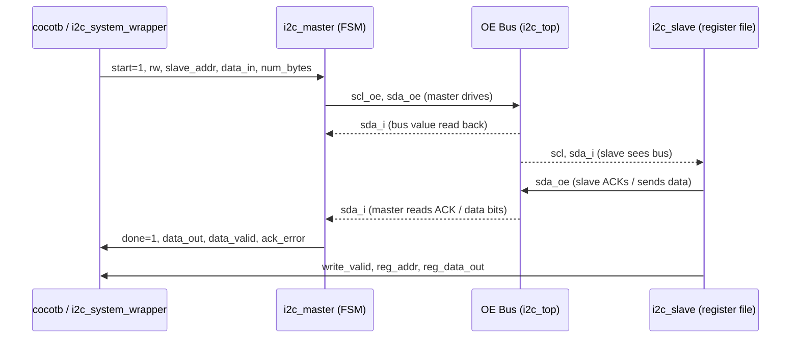

> **English version**: [01-rtl.md](../01-rtl.md)

# RTL：I2C Master/Slave 系統 — Verilog 設計參考

## 摘要

- 四個 Verilog 檔案實作了完整的 I2C master + slave 系統：`i2c_master.v`、`i2c_slave.v`、`i2c_top.v` 以及 `i2c_system_wrapper.v`（cocotb 進入點）。
- Master 是一個 8 狀態的 FSM，以 `CLK_DIV` 個系統時脈週期作為每個 I2C 位元週期（`i2c_master.v:38-45`）。
- Slave 包含一個 256 位元組的 EEPROM 暫存器檔案，具有自動遞增位址功能（`i2c_slave.v:23`）。
- 匯流排競爭透過 wired-AND OE 模型解決 — 不使用 Verilog 的 `inout`/`pullup`/`1'bz` — 使設計相容於 Verilator：`sda = ~(master_sda_oe | slave_sda_oe)`（`i2c_top.v:40`）。
- cocotb 包裝器 `i2c_system_wrapper.v` 沒有 Verilog `#delay` 時脈；時脈由 cocotb 的 `Clock` 產生器注入，可同時支援 Icarus Verilog 和 Verilator（`i2c_system_wrapper.v:47-49`）。

---

## 1. 概觀

### 此模組的功能

RTL 層實作了一個可合成的 I2C 子系統，包含：

| 檔案 | 角色 |
|------|------|
| `backend/sim/rtl/i2c_master.v` | I2C master 控制器 — 產生 SCL、驅動 SDA、執行 8 狀態交易 FSM |
| `backend/sim/rtl/i2c_slave.v` | I2C slave — 回應位址匹配，擁有 256 位元組 EEPROM 暫存器檔案 |
| `backend/sim/rtl/i2c_top.v` | 系統整合器 — 透過 OE 匯流排模型將 master 和 slave 連接在一起 |
| `backend/sim/tb/i2c_system_wrapper.v` | Cocotb DUT 包裝器 — 用於模擬器整合的薄殼層，不含測試邏輯 |
| `backend/sim/tb/i2c_system_tb.v` | 純 Verilog 自我檢查測試平台（獨立運作，不被 cocotb 使用） |

### 在系統中的角色

RTL 模組是模擬目標。cocotb Python 測試框架透過 `i2c_system_wrapper` 暴露的埠來驅動 DUT，產生波形追蹤（VCD 或 FST），而後端 API 則負責解讀結果。此 RTL 在本專案中並非用於 FPGA 合成，但除了 `i2c_slave.v` 中用於暫存器檔案初始化的 `initial` 區塊外，設計本身是可合成的。

### 邊界與相依性

- **上游（輸入）**：cocotb Python 驅動程式透過 `i2c_system_wrapper` 埠 — `clk`、`rst_n`、`start`、`rw`、`slave_addr`、`data_in`、`num_bytes`、`repeated_start`、`slave_addr_cfg`。
- **下游（輸出）**：`busy`、`done`、`ack_error`、`data_out`、`data_valid`、`byte_count`（master）；`slave_busy`、`reg_addr`、`reg_data_out`、`write_valid`（slave）。
- **內部匯流排**：`i2c_top.v` 中的 `sda` 和 `scl` 線路由組合邏輯計算 — 它們不會匯出到包裝器。

---

## 2. 資料流



### 訊號與協定細節

| 訊號路徑 | 方向 | 寬度 | 協定 / 備註 |
|-------------|-----------|-------|-----------------|
| `sda = ~(master_sda_oe \| slave_sda_oe)` | 組合邏輯線路 | 1 | Wired-AND 開漏極；`i2c_top.v:40` |
| `scl = ~master_scl_oe` | 組合邏輯線路 | 1 | 僅 master 驅動 SCL；`i2c_top.v:41` |
| `clk` | 輸入 | 1 | 系統時脈；包裝器預設配置為 10 ns 週期 |
| `data_out` | master → TB | 8 | 在 `data_valid` 脈衝時更新（每讀取一個位元組）；`i2c_master.v:160` |
| `write_valid` | slave → TB | 1 | 每個位元組寫入暫存器檔案後的單週期脈衝；`i2c_slave.v:193` |

### 時脈除頻器時序

Master 使用一個自由運行的除頻計數器（`clk_div_cnt`，`i2c_master.v:47`），達到 `CLK_DIV` 時歸零。由此衍生出四個時序標記點：

| Localparam | 值 (CLK_DIV=100) | 意義 |
|------------|---------------------|---------|
| `N_EDGE`   | 0                   | SCL 負緣瞬間 |
| `LOW_MID`  | 25                  | SCL 低電位半週期的中間點 — 切換 SDA |
| `P_EDGE`   | 50                  | SCL 正緣瞬間 |
| `HIGH_MID` | 75                  | SCL 高電位半週期的中間點 — 取樣 SDA |

來源：`i2c_master.v:33-36`。

---

## 3. 程式碼對照表

| 元件 | File | Evidence Location | 說明 |
|-----------|------|-------------------|-------------|
| Master 模組埠列表 | `backend/sim/rtl/i2c_master.v` | `:2-28` | 所有 master I/O 埠：控制輸入、狀態輸出、OE 匯流排介面 |
| `CLK_DIV` 參數 | `backend/sim/rtl/i2c_master.v` | `:31` | 每個 I2C 位元週期的時脈數；預設為 100 |
| 時序 localparam `N_EDGE / LOW_MID / P_EDGE / HIGH_MID` | `backend/sim/rtl/i2c_master.v` | `:33-36` | 每個 SCL 週期內相位關鍵的 SDA 切換 / 取樣點 |
| FSM 狀態編碼（8 個狀態） | `backend/sim/rtl/i2c_master.v` | `:38-45` | `IDLE`、`START`、`ADDR`、`WRITE`、`READ`、`ACK`、`REPEATED_START`、`STOP` |
| 時脈除頻計數器 | `backend/sim/rtl/i2c_master.v` | `:56-64` | 非同步重置計數器；驅動所有 FSM 時序決策 |
| SCL 產生 always 區塊 | `backend/sim/rtl/i2c_master.v` | `:67-83` | 在 IDLE/START 時 `scl_oe=0`（高電位）；否則在 P_EDGE 時切換低/高 |
| Master FSM always 區塊 | `backend/sim/rtl/i2c_master.v` | `:87-273` | 主要狀態機：所有 8 個狀態處理器 |
| START 狀態 — SDA 拉低 | `backend/sim/rtl/i2c_master.v` | `:117-121` | 在 SCL 為高時，於 `HIGH_MID` 將 SDA 驅動為低；形成 I2C START 條件 |
| ADDR 狀態 — MSB 優先位移 | `backend/sim/rtl/i2c_master.v` | `:124-126` | 在 `LOW_MID` 時 `sda_oe <= ~addr_buf[7-bit_cnt]` |
| ACK 狀態 — NACK 偵測 | `backend/sim/rtl/i2c_master.v` | `:188-201` | 在 `HIGH_MID` 取樣 `sda_i`；若為高則設定 `ack_error` |
| ACK 狀態 — master NACK（最後一個讀取位元組） | `backend/sim/rtl/i2c_master.v` | `:177-181` | Master 在最後一個位元組時保持 SDA 為高（釋放 `sda_oe`）以發出 NACK 訊號 |
| REPEATED_START 狀態 | `backend/sim/rtl/i2c_master.v` | `:255-269` | 在 SCL 為高時重新將 SDA 拉低；以更新的 `addr_buf` 重新進入 ADDR |
| STOP 狀態 | `backend/sim/rtl/i2c_master.v` | `:242-254` | 在 `LOW_MID` 將 SDA 拉低，在 `HIGH_MID` 釋放；產生 `done` 脈衝 |
| Slave 模組埠列表 | `backend/sim/rtl/i2c_slave.v` | `:3-22` | Slave I/O：`slave_addr` 設定、狀態輸出、OE 匯流排介面（直接接收 `scl`） |
| Slave 暫存器檔案 | `backend/sim/rtl/i2c_slave.v` | `:23-29` | `register_file[0:255]` — 256 x 8 位元，在 `initial` 區塊中初始化為零 |
| START / STOP 條件偵測 | `backend/sim/rtl/i2c_slave.v` | `:37-41` | 監視 `scl` 和 `sda_prev`/`sda_i` 邊緣的組合邏輯線路 |
| `in_read_ack_window` 保護邏輯 | `backend/sim/rtl/i2c_slave.v` | `:56-91` | 抑制在 master 於 read-ACK 階段釋放 SDA 時的假 STOP 偵測 |
| Slave FSM 狀態編碼 | `backend/sim/rtl/i2c_slave.v` | `:50` | `IDLE`、`ADDR`、`ACK`、`READ`、`WRITE`（5 個狀態） |
| Slave ADDR 狀態 — 位址匹配 | `backend/sim/rtl/i2c_slave.v` | `:107-125` | 在 `scl_rising` 時移入 8 位元；在第 8 位元後的 `scl_falling` 時比較 `slave_addr_recive[7:1]` 與 `slave_addr` |
| Slave WRITE 狀態 — 暫存器寫入與自動遞增 | `backend/sim/rtl/i2c_slave.v` | `:181-199` | 第一個接收到的位元組設定 `reg_addr`；後續位元組寫入 `register_file[reg_addr]` 並遞增 `reg_addr` |
| Slave READ 狀態 — 暫存器讀取與自動遞增 | `backend/sim/rtl/i2c_slave.v` | `:168-180` | 將 `register_file[reg_addr][7-bit_cnt]` 反轉後輸出至 `sda_oe`；收到 ACK 後自動遞增 |
| OE 匯流排 wired-AND 方程式 | `backend/sim/rtl/i2c_top.v` | `:40-41` | `sda = ~(master_sda_oe \| slave_sda_oe)` 和 `scl = ~master_scl_oe` |
| `i2c_top` 參數與埠列表 | `backend/sim/rtl/i2c_top.v` | `:4-35` | `CLK_DIV` 參數；所有 master + slave 埠皆已轉接 |
| 頂層中的 Master 實例 | `backend/sim/rtl/i2c_top.v` | `:44-64` | `i2c_master #(.CLK_DIV(CLK_DIV)) master_inst` |
| 頂層中的 Slave 實例 | `backend/sim/rtl/i2c_top.v` | `:67-78` | `i2c_slave slave_inst` — 接收計算後的 `scl` 和 `sda` 線路 |
| 包裝器預設參數 | `backend/sim/tb/i2c_system_wrapper.v` | `:5-6` | `CLK_DIV=50`、`SLAVE_ADDR=7'h50` |
| 包裝器 VCD 保護邏輯 | `backend/sim/tb/i2c_system_wrapper.v` | `:52-57` | VCD 傾印僅在 Icarus 下執行；Verilator 使用 `--trace` 建構旗標 |
| 獨立測試平台協定檢查器 | `backend/sim/tb/i2c_system_tb.v` | `:74-87` | 監視 `sda_bus` 和 `scl_bus` 的 START/STOP 邊緣；印出時間戳 |
| 獨立測試平台 `master_write` 任務 | `backend/sim/tb/i2c_system_tb.v` | `:134-170` | 驅動 1-3 位元組寫入交易，使用 fork/disable 處理提前 NACK |
| 獨立測試平台 `write_then_read` 任務 | `backend/sim/tb/i2c_system_tb.v` | `:198-211` | 指標寫入後接續循序讀取；展示典型的 EEPROM 存取模式 |

---

## 4. 疑難排解

### 問題：模擬卡住且 `done` 從未被觸發

**症狀**
- Cocotb 測試逾時（牆鐘時間超過 15 秒）或獨立測試平台觸及 5 ms 的 `$finish` 看門狗（`i2c_system_tb.v:61-65`）。
- `busy` 維持在高電位；`done` 從未產生脈衝。

**可能原因**
1. `rst_n` 從未被解除 — FSM 停留在重置狀態；`start` 被忽略。
2. cocotb 驅動程式在 DUT 的 `rst_n` 釋放前就發出了 `start=1`。
3. Master 送出的 slave 位址（`slave_addr`）與 `slave_addr_cfg` 不匹配，導致 slave 在位址階段回傳 NACK，master FSM 轉移到 STOP — 但若 `done` 仍未觸發，時脈可能沒有在運行。

**檢查位置**
- `i2c_master.v:87-100` — FSM 的重置初始化；確認在 `rst_n` 變高後 `state` 有到達 `IDLE`。
- `i2c_system_wrapper.v:47-49` — 時脈註解；確認 cocotb `Clock` 產生器在第一個 `await RisingEdge` 之前已啟動。
- `i2c_master.v:104-113` — IDLE 狀態；`start` 必須在 `rst_n=1` 之後至少一個週期才到達。

**修正方向**
- 確保 cocotb 測試在解除 `rst_n` 後呼叫數次 `await RisingEdge(dut.clk)` 再觸發 `start`。
- 驗證 `slave_addr_cfg` 與交易中的 `slave_addr` 驅動為相同的值。

---

### 問題：`ack_error` 意外被觸發

**症狀**
- `ack_error` 在位址階段或寫入位元組後變為高電位。
- 交易提前終止（master 移至 STOP）。

**可能原因**
1. 位址不匹配 — 交易中的 `slave_addr` 與連接至 slave 的 `slave_addr_cfg` 不同。
2. 時序問題 — Master 在 `HIGH_MID`（`i2c_master.v:187`）取樣 `sda_i` 時，slave 尚未釋放其 `sda_oe`，導致匯流排讀取為高電位（NACK）。
3. `CLK_DIV` 太小 — 若 `CLK_DIV < 4`，slave 的邊緣偵測邏輯（`i2c_slave.v:44-45` 中的 `scl_rising`、`scl_falling`）可能會漏掉轉態。

**檢查位置**
- `i2c_top.v:40` — 確認 wired-AND 正確；若 `slave_sda_oe` 卡在高電位，匯流排持續為低（虛假 ACK），若兩者皆為 0 則匯流排始終為高（NACK）。
- `i2c_master.v:188-201` — 在 `HIGH_MID` 的 ACK 取樣；交叉參照 `i2c_slave.v:127-167` 中的 slave `ACK` 狀態。
- `i2c_slave.v:113-124` — 位址位元計數必須在比較前到達 8；確認 `bit_cnt` 在每個 `scl_rising` 時遞增。

**修正方向**
- 增大 `CLK_DIV`（最小實用值約為 8，以配合 slave 的邊緣偵測延遲）。
- 新增波形檢查：將 `master_sda_oe`、`slave_sda_oe`、`sda` 一起傾印，以驗證 `HIGH_MID` 時的匯流排狀態。

---

### 問題：Slave 讀回錯誤的資料（過期或偏移的值）

**症狀**
- 讀取交易回傳的位元組與預期暫存器位址偏移了一個位置。
- 多位元組寫入後，資料出現在暫存器 `[N+1]` 而非 `[N]`。

**可能原因**
1. 讀取前未設定暫存器指標 — slave 的 `reg_addr` 在重置時初始化為 0，但在跨交易時保留其最後的值。未先執行指標寫入的讀取會從 `reg_addr` 上次停留的位置開始讀取。
2. 自動遞增雙步 — 在 WRITE 狀態中，slave 在 ACK 處理器中遞增 `reg_addr`（`i2c_slave.v:158`）；位址階段後收到的第一個位元組被視為指標位元組而非資料（`i2c_slave.v:191-192`）。

**檢查位置**
- `i2c_slave.v:130-139` — `ACK` + `ack_state==ADDR` 處理器；`first_byte_received` 在此初始化為 0，因此 WRITE 中的下一個位元組設定 `reg_addr`。
- `i2c_slave.v:181-199` — WRITE 狀態；`first_byte_received == 0` 導致 `reg_addr <= shift_reg`（指標），`first_byte_received == 1` 導致 `register_file[reg_addr] <= shift_reg`（資料）。
- `i2c_slave.v:142-151` — `ACK` + `ack_state==READ` 處理器；`reg_addr` 在每次 master 的 ACK 時遞增。

**修正方向**
- 在讀取交易之前，務必先發出一個寫入交易（1 位元組 = 暫存器指標）。`i2c_system_tb.v:198-211` 中的 `write_then_read` 任務展示了正確的模式。
- 對於循序多位元組讀取，自動遞增是刻意設計的；確保指標寫入指向所需範圍的第一個位址。

---

### 問題：在多位元組讀取期間 slave 偵測到假 STOP

**症狀**
- Slave 在讀取中途過早回到 IDLE，回傳垃圾資料或少於要求的位元組數。

**可能原因**
1. `in_read_ack_window` 保護邏輯未能抑制假 STOP。當 `in_read_ack_window` 過早被清除一個週期時可能發生此情況。
2. 保護暫存器狀態被意外重置（例如外部 `rst_n` 突波）。

**檢查位置**
- `i2c_slave.v:56-91` — `in_read_ack_window` 賦值與 `stop_condition` 保護邏輯；窗口涵蓋 `state==READ` 和 `state==ACK && ack_state==READ`。
- `i2c_slave.v:37-41` — `start_condition` 和 `stop_condition` 組合邏輯線路；在 master 從 READ 轉換到 ACK 時於波形中檢查。

**修正方向**
- 若需要，可透過對 `in_read_ack_window` 增加一個管線週期來擴大保護窗口。
- 驗證波形顯示 `stop_condition` 在整個位元組間 ACK 期間保持為 0。

---

## 5. 擴充指南

### 新增第二個 I2C slave（多 slave 匯流排）

**需要新增的內容**
- 第二個 `i2c_slave` 實例，使用不同的 `slave_addr_cfg`。
- 來自新 slave 的額外 `sda_oe` 線路。

**需要修改的檔案**
- `backend/sim/rtl/i2c_top.v` — 擴展 wired-AND 方程式：

  目前在 `i2c_top.v:39-41`：
  ```verilog
  wire master_sda_oe, slave_sda_oe, master_scl_oe;
  wire sda = ~(master_sda_oe | slave_sda_oe);
  wire scl = ~master_scl_oe;
  ```

  擴展模式：
  ```verilog
  wire master_sda_oe, slave0_sda_oe, slave1_sda_oe, master_scl_oe;
  wire sda = ~(master_sda_oe | slave0_sda_oe | slave1_sda_oe);
  wire scl = ~master_scl_oe;
  ```

- 依照 `i2c_top.v:67-78` 的模式新增第二個 `i2c_slave` 實例區塊，使用 `.slave_addr(slave_addr_cfg_1)` 和 `.sda_oe(slave1_sda_oe)`。

**需要建立的檔案**
- 不需要新檔案；slave RTL 已經參數化。

**應遵循的模式**
- 參考現有的 slave 實例（`i2c_top.v:67-78`）。
- 若 cocotb 需要觀察新 slave 的 `reg_addr`、`reg_data_out`、`write_valid`，則透過 `i2c_top` 埠匯出。

---

### 新增 master FSM 狀態（例如 10 位元定址）

**需要新增的內容**
- `i2c_master.v` 中新的 localparam 狀態常數。
- 若該狀態需要自訂 SCL 行為，在 SCL always 區塊（`i2c_master.v:67-83`）中新增 `case` 分支。
- 在 FSM always 區塊（`i2c_master.v:87-273`）中新增 `case` 分支。

**需要修改的檔案**
- `backend/sim/rtl/i2c_master.v` — 擴展 `:38-45` 的狀態編碼（3 位元 state 暫存器可容納 8 個狀態；若需要超過 8 個狀態，需將 `state` 加寬至 4 位元）。

**應遵循的模式**
- SDA 變更必須在 `LOW_MID` 進行；SDA 取樣在 `HIGH_MID`。參考 ADDR 狀態（`i2c_master.v:123-137`）作為參考實作。
- `bit_cnt` 在 ACK 狀態中重置為 0（`i2c_master.v:240`）；在新狀態中維持此慣例。

---

### 擴展 slave EEPROM 暫存器檔案大小

**需要新增的內容**
- 更寬的 `reg_addr` 暫存器和 `register_file` 陣列。

**需要修改的檔案**
- `backend/sim/rtl/i2c_slave.v` — 修改 `:23` 的陣列宣告：

  目前：
  ```verilog
  reg [7:0] register_file[0:255];
  ```

  512 位元組版本：
  ```verilog
  reg [7:0] register_file[0:511];
  reg [8:0] reg_addr;
  ```

- 更新 `:26-28` 的 `initial` 迴圈以涵蓋新的範圍。
- Slave 模組的 `reg_addr` 輸出埠宣告為 `[7:0]`（`i2c_slave.v:12`）；加寬至 `[8:0]` 並相應更新 `i2c_top.v:33` 和 `i2c_system_wrapper.v`。

**應遵循的模式**
- 自動遞增邏輯位於 `i2c_slave.v:147-149`（READ ACK）和 `:158`（WRITE ACK）— 除了加寬暫存器外不需要其他修改。

---

## 假設 / 待確認事項

- `假設：` `i2c_system_tb.v` 獨立測試平台不會被 cocotb 測試運行器呼叫。它似乎僅作為開發輔助工具；在範圍內未找到引用它的 `Makefile` 或運行器進入點。
- `假設：` `i2c_system_wrapper.v` 中 `CLK_DIV=50` 的預設值（而非 `i2c_master.v` 中的 100）是刻意設定的 — 包裝器的目標是更快的模擬。兩個值都是有效的；cocotb 運行器透過 `i2c_top` 參數覆蓋此值。

---

## 相關檔案索引

- `/home/linrswa/dev/verilog/i2c_lab/backend/sim/rtl/i2c_master.v`
- `/home/linrswa/dev/verilog/i2c_lab/backend/sim/rtl/i2c_slave.v`
- `/home/linrswa/dev/verilog/i2c_lab/backend/sim/rtl/i2c_top.v`
- `/home/linrswa/dev/verilog/i2c_lab/backend/sim/tb/i2c_system_wrapper.v`
- `/home/linrswa/dev/verilog/i2c_lab/backend/sim/tb/i2c_system_tb.v`
