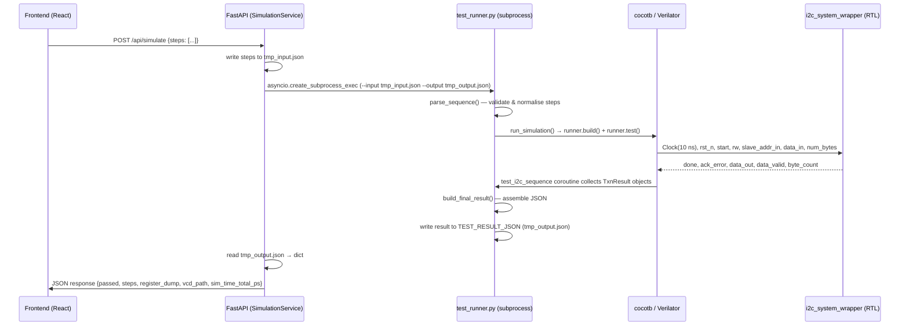

> **English version**: [02-simulation.md](../02-simulation.md)

# 模擬層：cocotb I2C Test Runner 與 Driver 參考文件

## 摘要

- `test_runner.py` 是 JSON 驅動模擬的單一入口點：它解析輸入的步驟列表，針對 DUT 執行 cocotb 協程，並輸出結構化的 JSON 結果 (`backend/sim/test_runner.py:888-978`)。
- `I2CDriver` 封裝了所有 DUT 訊號互動，使上層程式碼不需直接操作訊號線；其主要方法包括 `reset`、`write_bytes`、`read_bytes`、`scan`、`execute_transactions` 和 `get_register_dump` (`backend/sim/i2c_driver.py:42-895`)。
- `ProtocolInterpreter.interpret()` 將細粒度的協定步驟（`start`、`send_byte`、`recv_byte`、`repeated_start`、`stop`）轉換為 `Transaction` 資料類別物件，供驅動程式原子性地執行 (`backend/sim/protocol_interpreter.py:113-301`)。
- FastAPI 後端以子程序方式啟動 `test_runner.py`，透過暫存 JSON 檔案進行輸入輸出通訊，並使用 `asyncio.Lock` 進行單一並行序列化 (`backend/app/services/runner.py:106-173`)。
- Verilator 為預設模擬器；Icarus 為備用方案。三個 Verilator 必要的建置旗標為 `--trace`、`--public-flat-rw` 和 `--timing` (`backend/sim/test_runner.py:948-956`)。

---

## 1. 概述

模擬層位於 FastAPI 後端與 Verilog DUT 之間，其職責為：

1. **接受測試序列**：以 JSON 格式（來自 HTTP API 或 CLI）接收，並在產生任何模擬成本之前進行驗證。
2. **驅動 DUT**：透過 cocotb Python 介面，管理時脈啟動、重置序列，以及每種 I2C 交易類型的訊號時序。
3. **解譯結果**：將每位元組的時序、ACK/NACK 狀態及暫存器檔案快照對應回結構化的 JSON 文件，供前端使用。

### 邊界

| 邊界 | 方向 | 備註 |
|------|------|------|
| FastAPI (`SimulationService.run_simulation`) | 呼叫端 → 模擬 | 將 `{"steps": [...]}` 寫入暫存檔；讀回結果 JSON (`backend/app/services/runner.py:156-161`) |
| `test_runner.py` CLI / cocotb 入口點 | 邊界 | 透過 `TEST_STEPS_JSON` 環境變數接收步驟；將結果寫入 `TEST_RESULT_JSON` (`backend/sim/test_runner.py:835-874`) |
| `I2CDriver` | 模擬 → DUT 訊號 | 封裝 `i2c_system_wrapper` 連接埠；不對呼叫端暴露原始 cocotb handle (`backend/sim/i2c_driver.py:26-41`) |
| RTL (`i2c_system_wrapper`) | DUT | 訊號記載於 `docs/01-rtl.md`；DUT 預設使用 `CLK_DIV=50`、`SLAVE_ADDR=0x50` |

### 匯入慣例

`backend/sim/` 下的檔案使用裸模組匯入，因為子程序總是以 `cwd=backend/sim/` 執行：

```python
# backend/sim/test_runner.py:102-103
from i2c_driver import I2CDriver
from protocol_interpreter import ProtocolInterpreter
```

`backend/app/` 下的檔案使用套件限定匯入（`from sim.protocol_interpreter import ...`），因為它們在以 `backend/` 為根目錄的 FastAPI 程序中執行。

---

## 2. 資料流



### 協定與格式細節

| 元件 | 格式 | 佐證 |
|------|------|------|
| 子程序輸入 | JSON 檔案 `{"steps": [...]}` | `backend/app/services/runner.py:161` |
| 傳遞至 cocotb 的步驟 | `TEST_STEPS_JSON` 環境變數（JSON 字串） | `backend/sim/test_runner.py:835-836` |
| cocotb 輸出 | `TEST_RESULT_JSON` 環境變數 → 檔案路徑 | `backend/sim/test_runner.py:871-874` |
| VCD 波形檔名 | `VCD_FILENAME` 環境變數，預設 `i2c_system_cocotb.vcd` | `backend/sim/test_runner.py:852-855` |
| 時脈週期 | 10 ns (100 MHz)，透過 cocotb `Clock` | `backend/sim/test_runner.py:860` |
| DUT 頂層模組 | `i2c_system_wrapper` | `backend/sim/test_runner.py:163` |
| 建置產物目錄 | `backend/sim/sim_build/`（預設） | `backend/sim/test_runner.py:935-936` |
| 建置快取鍵值 | `i2c_master.v`、`i2c_slave.v`、`i2c_top.v` 的最大 mtime | `backend/app/services/runner.py:24-28, 77-91` |

---

## 3. 程式碼對照表

| 元件 | File Path | Evidence Location | 說明 |
|------|-----------|-------------------|------|
| `parse_step()` | `backend/sim/test_runner.py` | `:242-330` | 驗證單一原始步驟字典並將十六進位字串正規化為整數；遇到未知 `op` 時拋出 `ValueError` |
| `parse_sequence()` | `backend/sim/test_runner.py` | `:333-352` | 對列表中的每個步驟套用 `parse_step`；在模擬啟動前呼叫以快速失敗於錯誤輸入 |
| `VALID_OPS` / `PROTOCOL_OPS` | `backend/sim/test_runner.py` | `:217-234` | 所有支援操作名稱的 `frozenset`；`PROTOCOL_OPS` 是在 `start`…`stop` 之間緩衝的子集 |
| `execute_step()` | `backend/sim/test_runner.py` | `:360-457` | 執行單一舊式操作（`reset`、`write_bytes`、`read_bytes`、`scan`、`delay`）並回傳結果字典；協定操作在此會被拒絕 |
| `execute_sequence()` | `backend/sim/test_runner.py` | `:619-697` | 主分派迴圈：在 `start`/`stop` 之間緩衝協定操作，呼叫 `ProtocolInterpreter.interpret()` 然後 `driver.execute_transactions()`；舊式操作直接傳遞至 `execute_step()` |
| `_map_protocol_results()` | `backend/sim/test_runner.py` | `:460-616` | 將 `TxnResult` 物件對應回每步驟結果字典，包含每位元組的 `time_range_ps` 時間戳 |
| `build_final_result()` | `backend/sim/test_runner.py` | `:722-768` | 組裝頂層結果字典（`passed`、`steps`、`register_dump`、`reg_pointer`、`vcd_path`、`sim_time_total_ps`） |
| `run_sequence()` | `backend/sim/test_runner.py` | `:771-808` | 主要非同步入口點：依序呼叫 `execute_sequence`、`get_register_dump`、`get_reg_pointer`，然後 `build_final_result` |
| `test_i2c_sequence()` | `backend/sim/test_runner.py` | `:816-880` | cocotb `@cocotb.test()` 協程；讀取 `TEST_STEPS_JSON`，若缺少則自動前置 reset，啟動時脈，執行 `run_sequence`，寫入結果 JSON |
| `run_simulation()` | `backend/sim/test_runner.py` | `:888-978` | 編譯 RTL 並透過 `cocotb_tools.runner` 執行 cocotb 測試；選擇 Verilator 或 `_VcdIcarus`；傳遞步驟、結果路徑、VCD 檔名的環境變數 |
| `_VcdIcarus` | `backend/sim/test_runner.py` | `:106-130` | Icarus runner 子類別，覆寫 `_test_command` 以省略 `-fst`/`-none`，使 `$dumpfile`/`$dumpvars` 產生可被 `vcdvcd` 讀取的純文字 VCD |
| `main()` CLI | `backend/sim/test_runner.py` | `:1041-1162` | CLI 入口點；讀取 `--input` JSON，呼叫 `run_simulation()`，將結構化 JSON 寫入 `--output` 或 stdout；結束碼 0 = 通過，1 = 失敗 |
| `I2CDriver.__init__` | `backend/sim/i2c_driver.py` | `:42-54` | 儲存 DUT handle、`slave_addr_cfg`（預設 `0x50`）、`clk_div`（預設 `50`） |
| `I2CDriver.reset()` | `backend/sim/i2c_driver.py` | `:72-101` | 將 `rst_n=0` 維持 5 個週期後釋放，再穩定 5 個週期；先將所有控制輸入驅動至安全閒置值 |
| `I2CDriver.write_bytes()` | `backend/sim/i2c_driver.py` | `:107-250` | 高階寫入：將資料分割為 ≤14 位元組的交易，使用位址 ACK 等待 + `byte_count` 輪詢策略饋送酬載 |
| `I2CDriver.read_bytes()` | `backend/sim/i2c_driver.py` | `:256-362` | 高階讀取：先發出指標寫入，再對每個區塊發出讀取交易（stop-start 模式）；在 `data_valid` 時擷取位元組 |
| `I2CDriver.execute_transactions()` | `backend/sim/i2c_driver.py` | `:529-598` | 執行 `Transaction` 列表；在 STOP 邊界處分割為片段，透過 `_run_segment()` 處理 repeated-start 鏈 |
| `I2CDriver._run_segment()` | `backend/sim/i2c_driver.py` | `:600-785` | 涵蓋一個 repeated-start 鏈的單一硬體序列；監控 FSM 狀態 `dut.dut.master_inst.state` 以在每個 `REPEATED_START` 擷取視窗前更新訊號 |
| `I2CDriver.scan()` | `backend/sim/i2c_driver.py` | `:791-840` | 透過發送 1 位元組寫入探測從屬位址；若 `ack_error==0` 則回傳 `True` |
| `I2CDriver.get_register_dump()` | `backend/sim/i2c_driver.py` | `:842-871` | 直接讀取 `dut.dut.slave_inst.register_file[0:255]`（無 I2C 流量）；回傳所有 256 個暫存器的 `dict[int, int]` |
| `I2CDriver.get_reg_pointer()` | `backend/sim/i2c_driver.py` | `:873-885` | 回傳目前 `slave_inst.reg_addr` 值（0–255） |
| `Transaction` dataclass | `backend/sim/protocol_interpreter.py` | `:27-50` | 欄位：`addr`（7 位元）、`rw`（0=寫入/1=讀取）、`data_bytes`、`read_count`、`repeated_start` |
| `TxnResult` dataclass | `backend/sim/protocol_interpreter.py` | `:53-82` | 欄位：`ack_ok`、`data_read`、`bytes_written`、`start_time_ps`、`end_time_ps`、`byte_end_times_ps` |
| `ProtocolInterpreter.interpret()` | `backend/sim/protocol_interpreter.py` | `:113-301` | 狀態機解析器，將步驟分組為 `Transaction` 物件；自動將超過 14 位元組的寫入和超過 15 位元組的讀取進行分塊 |
| `validate_protocol_sequence()` | `backend/sim/protocol_interpreter.py` | `:309-465` | 乾跑結構驗證器；回傳錯誤字串列表而不執行任何操作 |
| `SimulationService.run_simulation()` | `backend/app/services/runner.py` | `:106-173` | 非同步方法；取得 `_sim_lock`，寫入暫存輸入 JSON，呼叫 `_invoke_runner`，讀取結果，清理暫存檔 |
| `SimulationService._invoke_runner()` | `backend/app/services/runner.py` | `:179-266` | 檢查建置快取（`_needs_compile`），透過 `asyncio.create_subprocess_exec` 啟動 `test_runner.py`，快取仍有效時使用 `--skip-build` |

---

## 4. 疑難排解

### 問題：模擬卡住且未回傳結果

**症狀**
- API 呼叫逾時（預設 `DEFAULT_TIMEOUT = 60` 秒，位於 `backend/app/services/runner.py:31`）。
- 在 `ps` 中可見子程序，伴隨活躍的 Verilator 或 `vvp` 子程序。
- 未寫入 `tmp_output_*.json`。

**可能原因**
1. 步驟序列開頭缺少 `reset`；DUT 的訊號未定義，主控 FSM 永遠不會離開 IDLE 狀態。自動前置邏輯僅在第一個步驟不是 `reset` 時觸發 (`backend/sim/test_runner.py:847-849`)，但若 `start` 操作為第一個元素，則會正確觸發前置。若序列直接透過 `execute_step` 發送（繞過 `execute_sequence`），則前置不會執行。
2. `write_bytes` 或 `read_bytes` 的從屬位址不符合 `slave_addr_cfg=0x50`；從屬裝置永遠不會 ACK，驅動程式迴圈無限輪詢 `done`——理論上不應發生，因為主控的 STOP 狀態即使在 NACK 時也會脈衝 `done`，但傳遞給 `I2CDriver` 的 `CLK_DIV` 值不正確可能會破壞位元組饋送時序視窗。
3. cocotb `Clock` 協程未在第一個 `await RisingEdge` 之前啟動。這在正常的 `test_i2c_sequence` 路徑中不會發生（時脈在 `backend/sim/test_runner.py:860` 啟動），但在自訂測試模組中可能發生。

**檢查位置**
- `backend/sim/test_runner.py:844-849` — 自動重置前置邏輯；驗證提交的步驟列表不為空，且前置後 `steps[0]["op"]` 為 `"reset"`。
- `backend/sim/i2c_driver.py:47-54` — `__init__` 參數；確認 `clk_div` 與 RTL `CLK_DIV` 參數一致（wrapper 預設 `CLK_DIV=50`，記載於 `docs/01-rtl.md`）。
- `backend/app/services/runner.py:231-244` — `asyncio.wait_for` 逾時處理器；被終止程序的 stderr 輸出通常能揭示 cocotb 卡住的位置。

**修正方向**
- 始終在任何自訂序列前置 `{"op": "reset"}`。
- 確保 `I2CDriver(dut, clk_div=50)` 與 `i2c_system_wrapper.v` 中的 RTL `CLK_DIV` 一致。
- 暫時增加 `DEFAULT_TIMEOUT` 並檢視 VCD 波形以識別哪個 FSM 狀態卡住。

---

### 問題：`send_byte` 步驟出現非預期的 `"status": "fail"`

**症狀**
- `send_byte` 結果條目具有 `"status": "fail"`，且第一個位元組上出現 `"addr"` / `"rw"` 欄位，表示位址被拒絕。
- 對應的 `TxnResult.ack_ok` 為 `False`。

**可能原因**
1. `send_byte` 步驟中的位址位元組編碼了錯誤的從屬位址。`start` 之後的第一個 `send_byte` 是組合的位址+RW 位元組 (`backend/sim/protocol_interpreter.py:230-234`)。對於從屬裝置 `0x50` 的寫入操作，該位元組必須為 `0xA0`（= `0x50 << 1 | 0`）。
2. DUT 中設定的從屬位址與測試序列不符。`slave_addr_cfg` 在重置期間被驅動至 `slave_addr_cfg` (`backend/sim/i2c_driver.py:94`)；其預設值為 `0x50`，與 wrapper 一致。

**檢查位置**
- `backend/sim/protocol_interpreter.py:230-234` — 位址位元組解碼：`addr = (raw_byte >> 1) & 0x7F`、`rw = raw_byte & 0x01`。
- `backend/sim/test_runner.py:581-596` — `_map_protocol_results` send_byte 處理器；結果字典中的 `addr` 和 `rw` 欄位在此從原始位元組解碼。
- `docs/01-rtl.md` 程式碼地圖中「ACK 狀態 — NACK 偵測」列（`i2c_master.v:188-201`）描述了 RTL 端的 NACK 條件。

**修正方向**
- 將位址位元組計算為 `(slave_addr << 1) | rw_bit`（例如，寫入為 `0x50 << 1 | 0 = 0xA0`，讀取為 `| 1 = 0xA1`）。
- 使用 `backend/sim/templates/` 下的範本檔案作為正確位元組值的參考。

---

### 問題：`execute_transactions` 結果中的 `data_read` 位元組錯誤或遺失

**症狀**
- 讀取的 `TxnResult.data_read` 短於 `read_count`，或包含未被寫入的 `0x00` 值。
- `get_register_dump()` 顯示預期值，但讀取結果回傳不同的資料。

**可能原因**
1. `repeated_start` 鏈結構不正確：設定暫存器指標的寫入交易具有 `repeated_start=False`，導致在讀取前發出 STOP，這會將從屬裝置的暫存器指標重置至 `reg_addr` 上次停留的位置 (`backend/sim/protocol_interpreter.py:174-176`)。
2. 讀取交易的 `read_count` 為 0，或區塊大小超過 15 位元組的硬體限制。解譯器會自動分塊讀取 (`backend/sim/protocol_interpreter.py:180-193`)，但若手動建構 `Transaction` 物件且 `read_count > 15`，驅動程式只會發出一個 `num_bytes=read_count` 命令，而 4 位元硬體暫存器會靜默截斷。
3. `data_valid` 在驅動程式的擷取迴圈開始之前就已脈衝（自訂測試程式碼中的競爭條件）。`_run_segment` 迴圈在每個 `RisingEdge` 上擷取 `data_valid` (`backend/sim/i2c_driver.py:694-700`)；在進入迴圈之前啟動讀取交易會遺失位元組。

**檢查位置**
- `backend/sim/protocol_interpreter.py:151-193` — `_flush()` 分塊邏輯；檢查 `interpret()` 回傳的每個物件上的 `Transaction.repeated_start`。
- `backend/sim/i2c_driver.py:461-527` — `_run_read_txn`；確認傳遞給 `dut.num_bytes` 的 `read_count` ≤15。
- `backend/sim/i2c_driver.py:503-510` — 讀取位元組擷取迴圈；驗證 `data_valid` 被觀察到且 `data_out` 被取樣。

**修正方向**
- 始終透過 `ProtocolInterpreter.interpret()` 建構 `Transaction` 物件，而非手動建構；解譯器能正確處理自動分塊和 `repeated_start` 旗標。
- 手動建構時，驗證每個 `Transaction.read_count <= 15` 且每個 `Transaction.repeated_start` 對除了最後一個 STOP 之外的所有交易都設定為 `True`。

---

### 問題：建置快取過期——模擬以舊版 RTL 執行

**症狀**
- 編輯 `.v` 檔案後，模擬仍表現出舊有行為。
- `--skip-build` 已傳遞給 `test_runner.py`，但 RTL 原始碼已變更。

**可能原因**
1. `SimulationService` 實例被重新啟動且 `_last_compile_mtime` 被重置為 `None`，但 `sim_build/` 包含舊的二進位檔。在重啟後的第一次執行中 `_needs_compile()` 回傳 `True` 並觸發新的編譯，因此此情境會自我修正。
2. 在 `_RTL_SOURCES` 監控列表之外的檔案被修改（例如 `i2c_system_wrapper.v` 或任何測試平台檔案）。監控列表僅涵蓋 `i2c_master.v`、`i2c_slave.v`、`i2c_top.v` (`backend/app/services/runner.py:24-28`)。

**檢查位置**
- `backend/app/services/runner.py:77-104` — `_current_rtl_mtime()` 和 `_needs_compile()`；若新的原始碼檔案會影響建置，請將其加入 `_RTL_SOURCES`。
- `backend/sim/test_runner.py:944-946` — `build_kwargs["always"] = not skip_build`；強制 `always=True` 可完全繞過快取。

**修正方向**
- 若 wrapper 的變更也需要使快取失效，請將 `i2c_system_wrapper.v` 加入 `backend/app/services/runner.py:24-28` 的 `_RTL_SOURCES`。
- 僅在確定沒有 RTL 變更時，才從 CLI 明確傳遞 `--skip-build`；省略該旗標以強制完整重新編譯。

---

## 5. 擴展指南

### 新增操作類型（例如 `write_masked`）

**需要新增的內容**

在步驟解析器和執行器中都支援新的 `op` 值。

**需要修改的現有檔案**

1. `backend/sim/test_runner.py:217-231` — 將新的操作名稱加入 `VALID_OPS`：

   ```python
   # backend/sim/test_runner.py:217-231 (reference)
   VALID_OPS = frozenset(
       {
           "reset",
           "write_bytes",
           "read_bytes",
           "scan",
           "delay",
           "start",
           "stop",
           "repeated_start",
           "send_byte",
           "recv_byte",
           # Add here:
           "write_masked",
       }
   )
   ```

2. `backend/sim/test_runner.py:276-330` — 在 `parse_step()` 中新增 `elif op == "write_masked":` 區塊以驗證並正規化新操作的參數。

3. `backend/sim/test_runner.py:388-456` — 在 `execute_step()` 中新增對應的 `elif op == "write_masked":` 區塊，呼叫適當的 `I2CDriver` 方法。

**需要建立的新檔案**

驅動程式層級的操作不需要新檔案。若新操作需要新的 `I2CDriver` 方法，請依照 `write_bytes` 的模式 (`backend/sim/i2c_driver.py:107-250`) 將其加入 `backend/sim/i2c_driver.py`：設定 DUT 訊號、脈衝 `start`、輪詢 `done`、回傳結果。

**應遵循的模式**

- 每個 `execute_step` 結果字典必須包含 `"op"` 和 `"status"` 鍵 (`backend/sim/test_runner.py:386`)。
- 時序擷取在驅動程式呼叫前後使用 `_sim_time_ps()`，儲存為 `result["time_range_ps"] = [t0, t1]` (`backend/sim/test_runner.py:390-394`)。
- 若操作具有 `expect` 欄位，設定 `result["match"] = (actual == expected)` (`backend/sim/test_runner.py:433-434`)。

---

### 新增 cocotb 測試套件

**需要新增的內容**

在 `backend/sim/tests/` 下新增一個 Python 模組，包含以 `@cocotb.test()` 裝飾的協程。

**需要修改的現有檔案**

獨立套件不需要修改。若要整合至主 runner，請在 `backend/sim/test_runner.py` 中新增匯入或參考，或建立獨立的 runner 調用。

**需要建立的新檔案**

`backend/sim/tests/test_<feature>.py` — 遵循 `backend/sim/tests/test_i2c_cocotb.py` 的結構：

1. 新增 `_setup(dut)` 輔助函式，呼叫 `cocotb.start_soon(Clock(dut.clk, 10, unit="ns").start())` 和 `await driver.reset()` (`backend/sim/tests/test_i2c_cocotb.py:74-84`)。
2. 新增 `sys.path.insert(0, str(_SIM_DIR))` 以確保裸匯入從 `backend/sim/` 解析 (`backend/sim/tests/test_i2c_cocotb.py:55-58`)。
3. 新增 `run_tests()` 函式，呼叫 `cocotb_tools.runner.get_runner("verilator")` 並使用與現有套件相同的建置參數 (`backend/sim/tests/test_i2c_cocotb.py:332-384`)：

   ```
   build_args=[
       "--trace",
       "--public-flat-rw",
       "--timing",
       "-Wno-WIDTHTRUNC",
       "-Wno-WIDTHEXPAND",
       "-Wno-UNOPTFLAT",
       "-Wno-INITIALDLY",
   ]
   ```

**應遵循的模式**

- 每個 `@cocotb.test()` 必須是自包含的，且先重置 DUT，使測試順序不影響結果 (`backend/sim/tests/test_i2c_cocotb.py:92-108`)。
- 在寫入和讀取交易之間使用 `await ClockCycles(dut.clk, 20)` 以允許從屬狀態機穩定 (`backend/sim/tests/test_i2c_cocotb.py:103`)。

---

### 支援第二個模擬器後端

**需要新增的內容**

在 `run_simulation()` 中新增新的 runner 類別或設定分支。

**需要修改的現有檔案**

`backend/sim/test_runner.py:927-932` — 模擬器選擇區塊：

```python
# backend/sim/test_runner.py:927-932
if simulator == "icarus":
    runner = _VcdIcarus()
else:
    runner = Verilator()
```

以 `elif simulator == "new_sim":` 分支擴展，實例化適當的 `cocotb_tools.runner` 子類別。

`backend/sim/test_runner.py:985-1037` — CLI `--simulator` 引數的 `choices` 列表和預設值。

`backend/app/services/runner.py:215-222` — 子程序命令組裝；若服務需要選擇新後端，請將 `--simulator` 旗標加入 `cmd`。

**建置旗標參考**

| 模擬器 | 必要旗標 | 佐證 |
|--------|----------|------|
| Verilator | `--trace`, `--public-flat-rw`, `--timing` | `backend/sim/test_runner.py:949-951` |
| Icarus（透過 `_VcdIcarus`） | 無（wrapper 中的 `$dumpfile`/`$dumpvars` 產生 VCD） | `backend/sim/test_runner.py:116-130` |

---

## 附錄 A：JSON 輸入結構定義

`test_runner.py --input` 接受的輸入 JSON 可以是步驟的裸陣列，或具有 `"steps"` 鍵的字典 (`backend/sim/test_runner.py:1071-1081`)：

```json
{"steps": [
  {"op": "reset"},
  {"op": "write_bytes", "addr": "0x50", "reg": "0x00", "data": ["0xDE", "0xAD"]},
  {"op": "read_bytes",  "addr": "0x50", "reg": "0x00", "n": 2, "expect": ["0xDE", "0xAD"]},
  {"op": "scan",        "addr": "0x50", "expect": true},
  {"op": "delay",       "cycles": 100},
  {"op": "start"},
  {"op": "send_byte",   "data": "0xA0"},
  {"op": "send_byte",   "data": "0x00"},
  {"op": "repeated_start"},
  {"op": "send_byte",   "data": "0xA1"},
  {"op": "recv_byte",   "ack": true},
  {"op": "recv_byte",   "ack": false},
  {"op": "stop"}
]}
```

整數欄位（`addr`、`reg`、`data` 元素、`expect` 元素）接受十進位整數或帶有 `"0x"` 前綴的十六進位字串 (`backend/sim/test_runner.py:174-204`)。

---

## 附錄 B：JSON 輸出結構定義

`build_final_result()` 產生以下頂層結構 (`backend/sim/test_runner.py:722-768`)：

```json
{
  "passed": true,
  "steps": [
    {"op": "reset",       "status": "ok",   "time_range_ps": [0, 1000]},
    {"op": "write_bytes", "status": "ok",   "ack": true,  "time_range_ps": [1000, 50000]},
    {"op": "read_bytes",  "status": "ok",   "data": ["0xde", "0xad"], "match": true, "time_range_ps": [50000, 100000]},
    {"op": "send_byte",   "status": "ok",   "data": "0xa0", "addr": "0x50", "rw": "write", "time_range_ps": [...]},
    {"op": "recv_byte",   "status": "ok",   "data": "0xde", "ack": true,  "time_range_ps": [...]}
  ],
  "register_dump": {"0": 222, "1": 173, "2": 0},
  "reg_pointer": 2,
  "vcd_path": "i2c_system_cocotb.vcd",
  "sim_time_total_ps": 120000
}
```

步驟的 `"status"` 為 `"ok"`、`"fail"`（協定層級 NACK）或 `"error"`（Python 例外）。`"match"` 欄位僅在步驟包含 `"expect"` 鍵時出現。`"passed"` 僅在每個步驟的 `status == "ok"` 且（若存在 `"match"`）`match == True` 時為 `True` (`backend/sim/test_runner.py:705-719`)。

---

## 假設 / 待確認事項

- `假設：` `backend/sim/test_runner.py` CLI 不會從 `SimulationService` 將 `--simulator` 傳遞給子程序；它總是使用預設的 `"verilator"`。服務需要在 `run_simulation()` 和 `cmd` 列表中新增 `simulator` 參數以支援執行時期後端選擇 (`backend/app/services/runner.py:215-222`)。
- `假設：` `TxnResult` 上的 `byte_end_times_ps` 欄位僅由 `_run_segment()`（repeated-start 路徑）填充，而非由 `_run_write_txn` / `_run_read_txn`（舊式路徑）填充。舊式方法回傳的 `TxnResult` 具有空的 `byte_end_times_ps` 列表 (`backend/sim/i2c_driver.py:453-459, 521-527`)。

---

## 相關檔案索引

- `/home/linrswa/dev/verilog/i2c_lab/backend/sim/test_runner.py`
- `/home/linrswa/dev/verilog/i2c_lab/backend/sim/i2c_driver.py`
- `/home/linrswa/dev/verilog/i2c_lab/backend/sim/protocol_interpreter.py`
- `/home/linrswa/dev/verilog/i2c_lab/backend/sim/tests/test_i2c_cocotb.py`
- `/home/linrswa/dev/verilog/i2c_lab/backend/sim/tests/test_protocol.py`
- `/home/linrswa/dev/verilog/i2c_lab/backend/sim/templates/protocol_write.json`
- `/home/linrswa/dev/verilog/i2c_lab/backend/sim/templates/protocol_write_read.json`
- `/home/linrswa/dev/verilog/i2c_lab/backend/sim/templates/repeated_start_read.json`
- `/home/linrswa/dev/verilog/i2c_lab/backend/app/services/runner.py`
- `/home/linrswa/dev/verilog/i2c_lab/backend/sim/tb/i2c_system_wrapper.v`
- `/home/linrswa/dev/verilog/i2c_lab/docs/01-rtl.md`
