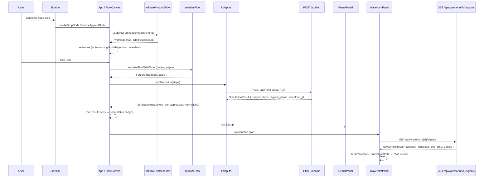

> **English version**: [04-frontend.md](../04-frontend.md)

# 前端：用於 I2C 協定模擬的 React Flow 畫布編輯器

## 摘要

- 本應用程式是一個使用 Vite 建構、以 Tailwind CSS 設定樣式的單頁 React 19 + TypeScript 應用程式（`frontend/package.json:13-17`）。
- 核心元件 `App`（位於 `frontend/src/App.tsx`）管理所有狀態：畫布節點/邊、模擬結果、面板尺寸及視窗持久化。
- 使用者透過在 React Flow 畫布上放置並連接五種自訂節點類型來建構 I2C 協定序列；流程透過對最長連接鏈進行 DFS 序列化為 `steps` 陣列（`frontend/src/lib/serialize.ts:153-189`）。
- 協定驗證在每次畫布變更時執行，並將警告寫入 `node.data.warning`，不會阻擋使用者操作（`frontend/src/lib/protocol-validate.ts:113-252`）。
- 模擬完成後，`WaveformPanel` 從 `GET /api/waveform/{id}/signals` 取得 VCD 訊號資料，並以獨立平移/縮放功能渲染 SVG 步階波形（`frontend/src/components/WaveformPanel.tsx:345-873`）。

---

## 1. 概述

前端是一個視覺化協定建構器，讓工程師能將 I2C 序列建構為有向流程圖，提交至模擬後端，並在不撰寫程式碼的情況下檢視時序波形及每步驟的結果。

### 職責

1. **畫布編輯** — React Flow 畫布，支援自由放置、從側欄拖放、手動繪製邊，以及 Delete/Backspace 鍵刪除。
2. **序列化** — 透過拓撲 DFS 將畫布圖形轉換為 `POST /api/run` 所預期的 `{ steps: [...] }` 酬載。
3. **客戶端驗證** — 兩層驗證：欄位級十六進位驗證會停用 Run 按鈕；協定結構驗證會在節點上添加警告標記。
4. **模擬派送** — `frontend/src/lib/api.ts:80` 中的 `runSimulation()` 將步驟列表以 POST 方式送出並標準化回應。
5. **結果渲染** — `ResultPanel` 顯示每步驟的通過/失敗結果（含主控端/從端欄位）及 256 位元組 EEPROM 十六進位傾印；`WaveformPanel` 渲染 VCD 訊號波形。
6. **持久化** — `useFlowAutosave` 每 500 毫秒將寫入操作去抖動後存至 `localStorage`，鍵名為 `i2c-demo-flow`（`frontend/src/lib/useFlowPersistence.ts:4,48-75`）。

### 模組邊界

| 層級 | 檔案 | 角色 |
|------|------|------|
| 進入點 | `frontend/src/main.tsx` | 將 `<App>` 掛載至 `#root` |
| 應用程式外殼 | `frontend/src/App.tsx` | 所有狀態；佈局；執行協調 |
| 自訂節點 | `frontend/src/components/nodes/` | 可渲染的 React Flow 節點元件 |
| 介面框架 | `frontend/src/components/` | Toolbar、Sidebar、ResultPanel、WaveformPanel、ResizeHandle |
| 程式庫 | `frontend/src/lib/` | 序列化、驗證、API、持久化、波形輔助工具 |

### API 基底 URL

`API_BASE` 在建構時從 `import.meta.env.VITE_API_URL` 解析，若該變數不存在則回退至 `/api`（`frontend/src/lib/api.ts:3`）。在開發環境中，Vite 開發伺服器會將 `/api` 代理至位於 `localhost:8000` 的 FastAPI 後端。

---

## 2. 資料流程



### 各邊界的關鍵資料結構

| 邊界 | 結構 | 依據 |
|------|------|------|
| 畫布節點資料 | `{ data: string }`（send_byte）或 `{ ack: boolean }`（recv_byte），另含可選的 `status`、`warning`、`addrHelper` | `frontend/src/lib/serialize.ts:5-13` |
| `serializeFlow` 輸出 | `StepPayload[]` — `StartStep`、`StopStep`、`RepeatedStartStep`、`SendByteStep`、`RecvByteStep` 的聯合型別 | `frontend/src/lib/serialize.ts:24-51` |
| `POST /api/run` 請求主體 | `{ "steps": StepPayload[] }` | `frontend/src/lib/api.ts:83-85` |
| `SimulationResult` | `{ passed, steps: StepResult[], register_dump, reg_pointer, waveform_id?, sim_time_total_ps? }` | `frontend/src/lib/api.ts:30-43` |
| `WaveformSignalsResponse` | `{ timescale, end_time, signals: Record<string, { width, changes: [number, string][] }> }` | `frontend/src/lib/api.ts:148-152` |
| `localStorage` 鍵 | `"i2c-demo-flow"` → `{ nodes, edges, viewport }` | `frontend/src/lib/useFlowPersistence.ts:4,6-10` |

---

## 3. 程式碼對照表

| 元件 | File Path | Evidence Location | 說明 |
|------|-----------|-------------------|------|
| `App`（預設匯出） | `frontend/src/App.tsx` | `:285-652` | 根元件；管理 nodes/edges 狀態、面板尺寸、執行邏輯及視窗還原旗標；渲染完整佈局 |
| `FlowCanvas` | `frontend/src/App.tsx` | `:203-283` | 內部元件（`ReactFlowProvider` 的子元件）；呼叫 `useReactFlow()` 取得視窗及自動存檔；處理拖放 |
| `applyVerticalLayout` | `frontend/src/App.tsx` | `:59-72` | 將所有節點正規化為單一 x 欄（`LAYOUT_X=100`），間距為 `NODE_HEIGHT + GAP`；清除模擬後的工具提示和寬度 |
| `buildAutoEdges` | `frontend/src/App.tsx` | `:79-87` | 在排序後的節點陣列中，為每對相鄰節點產生帶 `MarkerType.ArrowClosed` 的 smoothstep 邊 |
| `nodeTypes` 登錄 | `frontend/src/App.tsx` | `:91-97` | 將類型字串（`i2c_start`、`i2c_stop`、`repeated_start`、`send_byte`、`recv_byte`）對應至其 React 元件 |
| `handleRun` | `frontend/src/App.tsx` | `:544-591` | 呼叫 `serializeFlowWithOrder`，透過 `runSimulation` 以 POST 送出，將結果步驟對應回節點 ID 以顯示狀態標記 |
| `onNodesChange` | `frontend/src/App.tsx` | `:381-435` | 區分僅位置變更與結構變更；在刪除節點時橋接邊而不重新佈局 |
| `templateToNodesAndEdges` | `frontend/src/App.tsx` | `:154-173` | 使用 `opToNodeType` + `stepToNodeData` 將範本 `steps` 陣列轉換為 React Flow 節點，然後套用垂直佈局 |
| `Toolbar` | `frontend/src/components/Toolbar.tsx` | `:11-33` | 標題列，包含標題、`TemplateDropdown`、清除按鈕及 Run 按鈕（在 `isRunDisabled` 或 `isRunning` 時停用） |
| `TemplateDropdown` | `frontend/src/components/TemplateDropdown.tsx` | `:11-128` | 首次開啟時延遲載入 `GET /api/templates`；渲染列表框；以選擇的範本 ID 呼叫 `onSelect` |
| `Sidebar` | `frontend/src/components/Sidebar.tsx` | `:48-62` | 固定寬度的左側面板，列出所有五種節點類型；每個項目可點擊（附加）及可拖曳（自由放置） |
| `ResizeHandle` | `frontend/src/components/ResizeHandle.tsx` | `:16-97` | 相鄰彈性面板間的拖曳調整大小條；支援 `horizontal` 和 `vertical` 方向 |
| `ResultPanel` | `frontend/src/components/ResultPanel.tsx` | `:194-299` | 可收合的右側面板；渲染 `EepromDump`（256 位元組十六進位表）及 `StepTable`（含主控端/從端欄位的每步驟通過/失敗） |
| `WaveformPanel` | `frontend/src/components/WaveformPanel.tsx` | `:345-873` | 底部面板；取得訊號、管理 `selectedSignals`、透過 `buildSignalPath` 渲染 SVG 波形；支援滾輪縮放及拖曳平移 |
| `SignalPicker` | `frontend/src/components/WaveformPanel.tsx` | `:207-336` | 用於新增額外訊號至波形檢視的彈出搜尋介面 |
| `StartNode` | `frontend/src/components/nodes/StartNode.tsx` | `:13-58` | 僅輸出節點（僅底部把手）；綠色主題；顯示警告標記或通過/失敗狀態 |
| `StopNode` | `frontend/src/components/nodes/StopNode.tsx` | `:13-58` | 僅輸入節點（僅頂部把手）；玫瑰色主題 |
| `RepeatedStartNode` | `frontend/src/components/nodes/RepeatedStartNode.tsx` | `:13-66` | 輸入+輸出把手；橙色主題；僅在鏈中有前置 Start 時有效 |
| `SendByteNode` | `frontend/src/components/nodes/SendByteNode.tsx` | `:33-131` | 輸入+輸出把手；紫色主題；帶 `validateHexByte` 的十六進位輸入；顯示來自協定驗證的解碼位址輔助資訊（`addrHelper`） |
| `RecvByteNode` | `frontend/src/components/nodes/RecvByteNode.tsx` | `:15-105` | 輸入+輸出把手；青色主題；ACK/NACK 下拉選單；模擬後填入的唯讀 `receivedData` 欄位 |
| `serializeFlow` | `frontend/src/lib/serialize.ts` | `:204-206` | 公開進入點；回傳最長連接鏈的 `StepPayload[]` |
| `serializeFlowWithOrder` | `frontend/src/lib/serialize.ts` | `:214-218` | 與 `serializeFlow` 相同，但同時回傳平行的 `orderedNodeIds[]`，用於將結果對應回畫布節點 |
| `mapNodeToStep` | `frontend/src/lib/serialize.ts` | `:118-144` | 將單一 `FlowNode` 轉換為其 `StepPayload`；呼叫 `formatHex` 進行 `send_byte` 資料正規化 |
| `formatHex` | `frontend/src/lib/serialize.ts` | `:60-66` | 將十六進位輸入（`"50"`、`"0x50"`、`"0X50"`）正規化為標準 `"0xNN"` 大寫格式 |
| `validateProtocolFlow` | `frontend/src/lib/protocol-validate.ts` | `:113-252` | 遍歷最長鏈；狀態機檢查缺少 Stop、資料位元組位置錯誤及讀/寫方向不匹配；回傳 `warnings` 及 `addrHelpers` 對應表 |
| `validateHexByte` | `frontend/src/lib/validate.ts` | `:14-23` | 欄位級驗證器；拒絕空值、非十六進位及超出範圍（> 0xFF）的值；由 `SendByteNode` 使用 |
| `chainHasErrors` | `frontend/src/lib/validate.ts` | `:30-34` | 若任何節點的 `errors` 物件包含非空字串則回傳 `true`；用於控制 Run 按鈕 |
| `runSimulation` | `frontend/src/lib/api.ts` | `:80-103` | 以 POST 送至 `POST /api/run`；將每步驟的 `status` 標準化為 `passed` 布林值 |
| `getTemplate` | `frontend/src/lib/api.ts` | `:122-131` | 取得 `GET /api/templates/{id}` 並回傳包含步驟的完整 `TemplateDetail` |
| `getWaveformSignals` | `frontend/src/lib/api.ts` | `:163-180` | 取得 `GET /api/waveform/{id}/signals`；接受可選的訊號名稱篩選 |
| `loadPersistedFlow` / `clearPersistedFlow` | `frontend/src/lib/useFlowPersistence.ts` | `:13-39` | 讀取/移除 `localStorage["i2c-demo-flow"]` 並進行結構驗證 |
| `useFlowAutosave` | `frontend/src/lib/useFlowPersistence.ts` | `:48-75` | `useEffect` 鉤子，在最後一次 nodes/edges 變更後 500 毫秒將寫入去抖動存至 `localStorage` |
| `buildTimeToX` | `frontend/src/lib/waveform.ts` | `:82-90` | 工廠函式，回傳 `(timePs) => xPx` 的線性對應；由 `WaveformPanel` 和畫布佈局共用 |
| `buildSignalPath` | `frontend/src/components/WaveformPanel.tsx` | `:27-62` | 從 `[time_ps, value]` 變更列表建構由水平和垂直線段組成的 SVG 路徑字串 |

---

## 4. 疑難排解

### 問題：儘管畫布上有節點，Run 按鈕仍然停用

**症狀**
- Run 按鈕呈灰色且無法點擊。
- 畫布上有節點，但沒有邊連接它們，或 `SendByteNode` 顯示紅色邊框的輸入欄位。

**可能原因（依可能性排序）**
1. 沒有邊存在 — 當 `edges.length === 0` 時，`hasConnectedChain(edges)` 回傳 `false`（`frontend/src/App.tsx:186-188`）。節點必須至少由一條邊連接。
2. 某個 `SendByteNode` 帶有欄位驗證錯誤 — `nodesHaveErrors(nodes)` 讀取每個節點的 `node.data.errors`，若任何錯誤字串非空則回傳 `true`（`frontend/src/App.tsx:195-200`）。
3. 模擬已在執行中（`isRunning === true`）。

**檢查位置**
- 閘控條件：`frontend/src/App.tsx:522`（`isRunDisabled` 賦值）
- 欄位驗證：`frontend/src/lib/validate.ts:14-23`（`validateHexByte`）
- 錯誤傳播至節點資料：`frontend/src/components/nodes/SendByteNode.tsx:41-44`

**修正方向**
- 從一個節點的底部把手拖曳到下一個節點的頂部把手來繪製邊。
- 修正 `SendByteNode` 輸入中的十六進位值（接受的格式：`0xA0`、`A0`、`a0`）。

---

### 問題：節點上出現非預期的協定警告標記

**症狀**
- 節點標題變黃並顯示 `!` 標記。
- 節點內出現如「Send Byte must be between Start and Stop」或「Recv Byte used in write mode」的警告文字。

**可能原因（依可能性排序）**
1. `send_byte` 或 `recv_byte` 節點被放置在最長鏈中 Start-Stop 區段之外。
2. 位址位元組（Start 後的第一個 `send_byte`）暗示的讀/寫方向與後續資料節點衝突 — 例如，位址位元組 LSB=0 後出現 `recv_byte`。
3. `repeated_start` 節點出現但前面沒有 Start 條件。

**檢查位置**
- 狀態機邏輯：`frontend/src/lib/protocol-validate.ts:143-249`
- 警告注入節點資料：`frontend/src/App.tsx:355-372`
- 節點中的警告顯示：`frontend/src/components/nodes/StartNode.tsx:26-31`（五種節點類型共用此模式）

**修正方向**
- 確保序列為：`i2c_start` → （可選的位址 `send_byte`）→ 資料位元組 → `i2c_stop`。
- 對於讀取交易，位址位元組的 LSB 必須為 1（例如 `0xA1`）；後接 `recv_byte` 節點。
- 對於寫入交易，位址位元組的 LSB 必須為 0（例如 `0xA0`）；後接 `send_byte` 節點。

---

### 問題：波形面板顯示「Failed to load waveform signals」或無波形

**症狀**
- 成功執行後，波形面板標題顯示錯誤訊息。
- 儘管模擬結果中存在 `waveform_id`，面板主體仍為空白。

**可能原因（依可能性排序）**
1. VCD 檔案從未寫入或已在後端過期（預設 TTL：30 分鐘）。後端端診斷請參見 `docs/03-backend-api.md` 的疑難排解章節。
2. `DEFAULT_SIGNALS` 列表（`['sda', 'scl']`）包含 VCD 中不存在的訊號名稱；請求所有訊號的初始取得成功，但個別訊號可能不匹配（`frontend/src/components/WaveformPanel.tsx:23,482-493`）。
3. 網路錯誤導致 `GET /api/waveform/{id}/signals` 呼叫無法完成。

**檢查位置**
- 取得效果：`frontend/src/components/WaveformPanel.tsx:468-505`
- 錯誤顯示路徑：`WaveformPanel.tsx:496-497`
- 預設訊號常數：`WaveformPanel.tsx:23`

**修正方向**
- 透過檢查瀏覽器的 Network 分頁，確認 `POST /api/run` 回傳了非空的 `waveform_id`。
- 若 VCD 檔案已過期，重新執行模擬。
- 使用面板標題中的「open in Surfer」或「download VCD」連結確認檔案可存取（`WaveformPanel.tsx:611-628`）。

---

### 問題：頁面重新載入後畫布狀態遺失

**症狀**
- 重新整理後所有節點和邊消失。
- `localStorage["i2c-demo-flow"]` 不存在或格式錯誤。

**可能原因（依可能性排序）**
1. 儲存時超出 `localStorage` 配額；配額錯誤被靜默忽略（`frontend/src/lib/useFlowPersistence.ts:69`）。
2. 瀏覽器處於私密/無痕模式，`localStorage` 在關閉時被清除。
3. 使用者或另一個分頁呼叫了 `clearPersistedFlow()`（由 `frontend/src/App.tsx:515` 處的清除按鈕觸發）。

**檢查位置**
- 自動存檔鉤子：`frontend/src/lib/useFlowPersistence.ts:48-75`
- 掛載時還原：`frontend/src/App.tsx:288-295`
- 儲存鍵：`frontend/src/lib/useFlowPersistence.ts:4`

**修正方向**
- 開啟 DevTools → Application → Storage 中的 `localStorage`；檢查 `i2c-demo-flow` 鍵是否存在且為包含 `nodes`、`edges` 及 `viewport` 欄位的有效 JSON。
- 若問題為配額不足，減少畫布複雜度或清除其他 `localStorage` 項目。

---

### 問題：載入範本時靜默取代畫布

**症狀**
- 在下拉選單中點擊範本時，若畫布為空則不經確認直接捨棄當前畫布；若有內容，瀏覽器會顯示可能被忽略的確認對話框。

**可能原因**
1. 畫布為空（`nodes.length === 0 && edges.length === 0`），因此跳過了防護檢查（`frontend/src/App.tsx:526`）。

**檢查位置**
- 防護邏輯：`frontend/src/App.tsx:524-528`

**修正方向**
- 若要始終提示，移除 `App.tsx:526` 處的空畫布短路條件。

---

## 5. 擴充指南

### 新增節點類型

**要新增的內容**：一個新的 I2C 操作，以畫布節點表示（例如「Delay」節點）。

**需建立的新檔案**：
- `frontend/src/components/nodes/DelayNode.tsx` — 參照 `SendByteNode.tsx` 的模式。包含位於 `Position.Top`（`type="target"`）和 `Position.Bottom`（`type="source"`）的 `Handle` 元件。新增包含節點可編輯欄位的 `DelayNodeData` 介面。在 `onChange` 處理器中使用 `useReactFlow().setNodes`。

**需修改的現有檔案**：

1. `frontend/src/components/nodes/index.ts` — 匯出新元件（遵循現有的重新匯出模式）。

2. `frontend/src/App.tsx:91-97` — 在 `nodeTypes` 中註冊新類型：
   ```ts
   // frontend/src/App.tsx:91-97
   const nodeTypes: NodeTypes = {
     i2c_start: StartNode,
     i2c_stop: StopNode,
     repeated_start: RepeatedStartNode,
     send_byte: SendByteNode,
     recv_byte: RecvByteNode,
     delay: DelayNode,           // add here
   }
   ```

3. `frontend/src/App.tsx:100-113` — 新增 `case 'delay'` 至 `buildDefaultData`，填入適當的預設值。

4. `frontend/src/App.tsx:120-129` — 新增 `case 'delay'` 至 `opToNodeType`，將後端操作名稱對應回畫布類型。

5. `frontend/src/lib/serialize.ts:118-144` — 新增 `case 'delay'` 至 `mapNodeToStep`，回傳正確的 `StepPayload` 結構。

6. `frontend/src/components/Sidebar.tsx:8-14` — 在 `PROTOCOL_NODE_TYPES` 中附加一個項目：
   ```ts
   // frontend/src/components/Sidebar.tsx:8-14
   { type: 'delay', label: 'Delay', color: '#64748b', description: 'Insert a timed delay' },
   ```

7. `frontend/src/lib/protocol-validate.ts:148-239` — 若新類型有協定結構限制，在 `validateProtocolFlow` 的 switch 中新增 `case 'delay'`；否則預設的靜默忽略路徑已可處理。

**參考實作**：`frontend/src/components/nodes/SendByteNode.tsx:33-131`（含可編輯欄位及驗證的節點）；`frontend/src/components/nodes/StartNode.tsx:13-58`（無資料節點）。

---

### 新增 API 呼叫

**要新增的內容**：為新的後端端點建立型別化包裝函式。

**需修改的現有檔案**：`frontend/src/lib/api.ts` — 參照 `getWaveformSignals`（`api.ts:163-180`）的模式：

1. 定義回應結構的 TypeScript 介面。
2. 使用 `new URL(...)` 建構 URL 以處理編碼。
3. 呼叫 `fetch`，檢查 `response.ok`，失敗時透過 `extractErrorMessage` 擷取錯誤訊息（`api.ts:63-72`），並回傳型別化的 JSON。

---

### 擴充 ResultPanel 新增區段

**要新增的內容**：在結果面板中新增額外的顯示區段（例如時序統計）。

**需修改的現有檔案**：`frontend/src/components/ResultPanel.tsx:256-295` — 在 `isExpanded` 主體內新增區段。面板使用 flex-column 佈局：`EepromDump` 區塊為 `flex-shrink-0`（始終可見），接著是可捲動的步驟結果區域。新區段可插入兩者之間或附加在下方。

**可用資料**：`SimulationResult` 的所有欄位都可從 `result` 屬性取得（`frontend/src/components/ResultPanel.tsx:4`）。`sim_time_total_ps` 欄位可透過 `result.sim_time_total_ps` 取得（`frontend/src/lib/api.ts:42`）。

---

### 變更畫布持久化鍵或去抖動延遲

**需修改的現有檔案**：`frontend/src/lib/useFlowPersistence.ts`

- 儲存鍵：`useFlowPersistence.ts:4` 處的 `FLOW_STORAGE_KEY` — 變更字串將其指向不同的瀏覽器儲存位置。
- 去抖動延遲：`useFlowPersistence.ts:60` 處的 `setTimeout` 使用硬編碼的 `500` 毫秒 — 變更此數值以調整最後一次編輯後儲存畫布的速度。

---

## 假設 / 待確認事項

- `假設：``nodes/index.ts` 重新匯出桶（`frontend/src/components/nodes/index.ts`）已確認存在但未完整讀取；其匯出是從 `App.tsx:22-27` 的匯入推斷而來。假設它重新匯出所有五個節點元件。
- `假設：``WaveformPanel.tsx:611` 引用的 Surfer 波形檢視器（`/surfer/index.html`）是單獨部署的靜態資源。其是否存在未經驗證；若不存在，「open in Surfer」連結將回傳 404，但不影響面板內的波形渲染。
- `假設：``api.ts:3` 使用的 `VITE_API_URL` 環境變數未在儲存庫的 `.env` 檔案中設定（未找到任何 `.env` 檔案）。在開發環境中，預設的 `/api` 路徑依賴 `vite.config.ts` 中設定的 Vite 代理（未讀取）；在正式環境中，後端必須從相同來源提供服務，或在建構時設定該變數。

---

## 相關檔案索引

- `/home/linrswa/dev/verilog/i2c_lab/frontend/src/App.tsx`
- `/home/linrswa/dev/verilog/i2c_lab/frontend/src/main.tsx`
- `/home/linrswa/dev/verilog/i2c_lab/frontend/src/components/Toolbar.tsx`
- `/home/linrswa/dev/verilog/i2c_lab/frontend/src/components/Sidebar.tsx`
- `/home/linrswa/dev/verilog/i2c_lab/frontend/src/components/ResultPanel.tsx`
- `/home/linrswa/dev/verilog/i2c_lab/frontend/src/components/WaveformPanel.tsx`
- `/home/linrswa/dev/verilog/i2c_lab/frontend/src/components/ResizeHandle.tsx`
- `/home/linrswa/dev/verilog/i2c_lab/frontend/src/components/TemplateDropdown.tsx`
- `/home/linrswa/dev/verilog/i2c_lab/frontend/src/components/nodes/StartNode.tsx`
- `/home/linrswa/dev/verilog/i2c_lab/frontend/src/components/nodes/StopNode.tsx`
- `/home/linrswa/dev/verilog/i2c_lab/frontend/src/components/nodes/RepeatedStartNode.tsx`
- `/home/linrswa/dev/verilog/i2c_lab/frontend/src/components/nodes/SendByteNode.tsx`
- `/home/linrswa/dev/verilog/i2c_lab/frontend/src/components/nodes/RecvByteNode.tsx`
- `/home/linrswa/dev/verilog/i2c_lab/frontend/src/components/nodes/index.ts`
- `/home/linrswa/dev/verilog/i2c_lab/frontend/src/lib/api.ts`
- `/home/linrswa/dev/verilog/i2c_lab/frontend/src/lib/serialize.ts`
- `/home/linrswa/dev/verilog/i2c_lab/frontend/src/lib/serialize.test.ts`
- `/home/linrswa/dev/verilog/i2c_lab/frontend/src/lib/protocol-validate.ts`
- `/home/linrswa/dev/verilog/i2c_lab/frontend/src/lib/validate.ts`
- `/home/linrswa/dev/verilog/i2c_lab/frontend/src/lib/waveform.ts`
- `/home/linrswa/dev/verilog/i2c_lab/frontend/src/lib/useFlowPersistence.ts`
- `/home/linrswa/dev/verilog/i2c_lab/frontend/package.json`
- `/home/linrswa/dev/verilog/i2c_lab/docs/03-backend-api.md`
